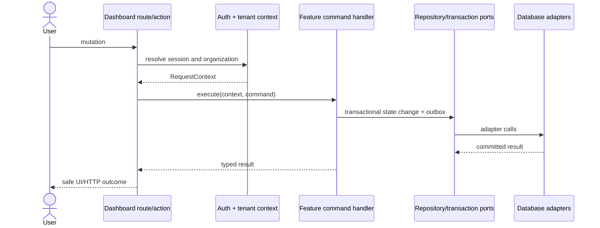
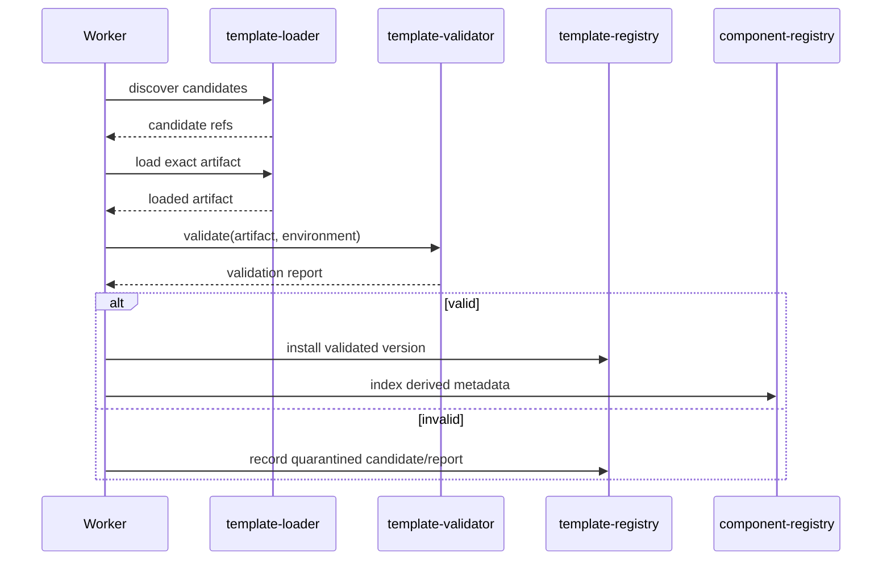
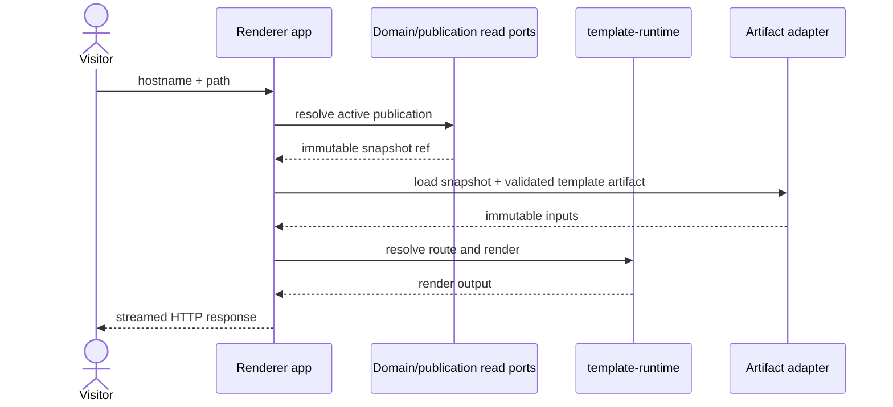

# Specification 01: Monorepo and Package Structure

Status: Approved
Approved by: Architecture owner
Architecture source: [`ARCHITECTURE.md`](../../ARCHITECTURE.md)
Implementation authorization: User-approved
Next specification after approval: Database design

## 1. Purpose and scope

This specification turns the frozen architecture into an enforceable TypeScript monorepo structure. It defines application and package ownership, dependency direction, public interfaces, internal composition, data flow between deployables, error boundaries, extension points, implementation order, and structural testing.

This specification does not define database tables, complete SDK types, rendering algorithms, or publication algorithms. Their package locations and dependency boundaries are specified here; their behavior will be specified in the subsequent approved documents.

## 2. Normative language

`MUST`, `MUST NOT`, `SHOULD`, and `MAY` are normative. A package name beginning with `@factory/` is an internal workspace package. Template packages use `@templates/`; plugin packages use `@plugins/`. Actual organization scopes may be changed once before implementation without changing package responsibilities.

## 3. Structural goals

The monorepo MUST:

1. Keep dashboard, public renderer, worker, and Template Lab independently buildable and deployable.
2. Make domain and application logic independent of Next.js, Prisma, queue, storage, cache, auth, and DNS/TLS vendors.
3. Prevent concrete templates and plugins from being imported by Factory applications or core packages.
4. Give each frozen architectural responsibility one unambiguous owning package.
5. Expose narrow package entry points and forbid internal deep imports.
6. Allow future extraction of measured hot spots without pretending they are services today.
7. Require every implemented abstraction to map to a Doctor or Clinic acceptance scenario.
8. Support independent contract versioning without coupling versions to the monorepo release number.

## 4. Tooling baseline

The workspace uses:

- pnpm workspaces for dependency installation and workspace linking;
- Turborepo for the task graph and local/remote build caching;
- TypeScript strict mode with a shared base configuration;
- ESLint with boundary rules and import restrictions;
- Prettier for source formatting;
- Vitest for unit and package integration tests;
- Playwright for deployable application flows;
- Testcontainers for infrastructure-backed integration tests;
- Changesets for package release intent and changelogs when versioned packages begin publishing;
- dependency-cruiser or an equivalent static boundary verifier;
- Node.js as the default server runtime.

Exact tool versions are pinned in the root package manager lockfile. Renovation is performed through reviewed dependency updates, never floating version ranges in CI.

## 5. Complete directory structure

```text
portfolio-factory/
├─ apps/
│  ├─ dashboard/
│  │  ├─ src/
│  │  │  ├─ app/                    # Next.js App Router only
│  │  │  │  ├─ (auth)/
│  │  │  │  ├─ (dashboard)/
│  │  │  │  ├─ api/                 # webhooks/external HTTP only
│  │  │  │  ├─ layout.tsx
│  │  │  │  ├─ error.tsx
│  │  │  │  └─ not-found.tsx
│  │  │  ├─ features/               # app-local UI composition by feature
│  │  │  ├─ server/                 # app composition root and adapters
│  │  │  └─ styles/
│  │  ├─ public/
│  │  ├─ tests/
│  │  ├─ next.config.ts
│  │  └─ package.json
│  ├─ renderer/
│  │  ├─ src/
│  │  │  ├─ app/
│  │  │  │  ├─ [[...path]]/         # generic public route
│  │  │  │  ├─ _preview/            # signed preview boundary
│  │  │  │  ├─ api/health/
│  │  │  │  ├─ layout.tsx
│  │  │  │  ├─ error.tsx
│  │  │  │  └─ not-found.tsx
│  │  │  ├─ server/                 # renderer composition root/adapters
│  │  │  └─ styles/                 # platform reset only
│  │  ├─ public/
│  │  ├─ tests/
│  │  ├─ next.config.ts
│  │  └─ package.json
│  ├─ worker/
│  │  ├─ src/
│  │  │  ├─ bootstrap/
│  │  │  ├─ handlers/
│  │  │  ├─ schedules/
│  │  │  ├─ health/
│  │  │  └─ main.ts
│  │  ├─ tests/
│  │  └─ package.json
│  └─ template-lab/
│     ├─ src/
│     │  ├─ app/
│     │  ├─ fixtures/
│     │  └─ server/
│     ├─ tests/
│     ├─ next.config.ts
│     └─ package.json
├─ packages/
│  ├─ template-sdk/
│  ├─ template-loader/
│  ├─ template-validator/
│  ├─ template-runtime/
│  ├─ template-registry/
│  ├─ component-registry/
│  ├─ plugin-sdk/
│  ├─ plugin-runtime/
│  ├─ publication-contract/
│  ├─ publication-compiler/
│  ├─ domain/
│  ├─ application/
│  ├─ database/
│  ├─ auth/
│  ├─ tenancy/
│  ├─ content/
│  ├─ publishing/
│  ├─ domains/
│  ├─ media/
│  ├─ editor-schema/
│  ├─ ui/
│  ├─ observability/
│  ├─ jobs/
│  ├─ config/
│  └─ testkit/
├─ templates/
│  ├─ doctor/
│  │  ├─ src/
│  │  ├─ fixtures/
│  │  ├─ tests/
│  │  ├─ matrouh.template.json
│  │  └─ package.json
│  ├─ clinic/
│  └─ shared/                         # optional template-owned shared library
├─ plugins/                           # empty until an approved first-release use case
├─ tooling/
│  ├─ eslint-config/
│  ├─ typescript-config/
│  ├─ test-config/
│  └─ scripts/
├─ docs/
│  ├─ adr/
│  ├─ contracts/
│  ├─ runbooks/
│  ├─ threat-model/
│  └─ specifications/
├─ infrastructure/
│  ├─ local/                          # local-only service definitions
│  └─ migrations/                     # operational migration helpers, not DB schema
├─ .changeset/
├─ .github/workflows/
├─ package.json
├─ pnpm-lock.yaml
├─ pnpm-workspace.yaml
├─ turbo.json
├─ tsconfig.json
└─ ARCHITECTURE.md
```

`infrastructure/` contains deployment-neutral local development configuration and operational scripts only. Provider-specific production infrastructure is deferred until the deployment-target ADR is approved. Prisma and SQL database migrations belong to `packages/database`, not `infrastructure/`.

## 6. Standard package anatomy

Every internal package MUST follow this shape unless its documented responsibility makes a folder irrelevant:

```text
packages/<name>/
├─ src/
│  ├─ index.ts                  # deliberately small public entry point
│  ├─ contracts/                # public interfaces/DTOs owned by this package
│  ├─ domain/                   # package-owned pure policy/value logic
│  ├─ application/              # commands, queries, orchestration
│  ├─ ports/                    # interfaces implemented by adapters
│  ├─ adapters/                 # optional default infrastructure adapters
│  └─ internal/                 # never exported
├─ tests/
│  ├─ unit/
│  ├─ integration/
│  └─ contract/
├─ package.json
├─ tsconfig.json
└─ README.md
```

Rules:

- `src/index.ts` and explicitly declared subpath exports are the only supported imports.
- Consumers MUST NOT import `src/internal`, generated Prisma types, or another package's adapter internals.
- Public types MUST be framework-neutral unless the package is explicitly a framework adapter (`ui`, an app, or a named adapter subpath).
- Package `README.md` MUST list owner, responsibility, public exports, dependencies, prohibited dependencies, and Doctor/Clinic use cases.
- Generated artifacts live under `generated/`, are excluded from manual editing, and have a reproducible generation command.
- A package MUST NOT be created merely to hold one generic helper. Such code remains private to its owner until a second real consumer proves a shared boundary.

## 7. Dependency layers

```text
Layer 5  apps and concrete template/plugin packages
           ↓
Layer 4  composition/adapters: database, auth, jobs, observability, config
           ↓
Layer 3  feature/application: content, publishing, domains, media,
         template-registry, component-registry, plugin-runtime
           ↓
Layer 2  engines/contracts: template-loader, template-validator,
         template-runtime, publication-compiler, editor-schema
           ↓
Layer 1  stable contracts/kernel: domain, application,
         template-sdk, plugin-sdk, publication-contract
```

Dependencies normally point downward. A lower layer communicates upward only through a port supplied by the composition root. Layer numbers express allowed dependency direction, not runtime call direction.

Exceptions must be documented in an ADR and boundary configuration. Circular package dependencies are forbidden. Type-only circularity is also forbidden because it obscures ownership.

### 7.1 Import prohibitions

- No `@factory/*` package may import `@templates/*` or `@plugins/*`.
- `template-sdk` MUST NOT import any other Factory feature package.
- `publication-contract` MAY import only `domain` and schema libraries.
- `domain` MUST NOT import application, infrastructure, React, Next.js, Prisma, or vendor SDKs.
- `application` MUST NOT import Prisma, Next.js, React, vendor SDKs, or concrete adapters.
- Feature packages MUST NOT import an app.
- Renderer MUST NOT import draft mutation interfaces, editor UI, Prisma models, or concrete templates.
- Dashboard MUST NOT import template render implementations.
- Worker handlers MUST invoke package public use cases; they MUST NOT mutate feature tables through Prisma directly.
- `ui` MUST NOT import server-only packages.
- `testkit` MUST NOT be a production dependency.

## 8. Application specifications

### 8.1 `apps/dashboard`

Responsibilities:

- authenticated control-plane web UI;
- Next.js route/layout composition;
- Server Component reads and Server Action mutations;
- external webhooks and documented HTTP endpoints through Route Handlers;
- dynamic editor shell built from `editor-schema` output;
- application composition root for dashboard processes.

Public interfaces:

- browser routes under the configured control-plane hostname;
- explicitly versioned webhook/API routes;
- health and readiness endpoints;
- no importable TypeScript library surface.

Internal components:

- `features/<feature>/components`, `actions`, and view-model mappers;
- `server/container.ts` wiring ports to adapters;
- session/tenant request context factory;
- error-to-HTTP/UI mapper.

Errors from application packages are mapped centrally to safe UI/HTTP outcomes. Unknown errors receive a correlation ID, are reported, and expose no internal details. UI components do not inspect database/vendor errors.

Extension points are schema field adapters, feature route composition, and explicitly approved external endpoints. Template-specific dashboard routes are forbidden.

### 8.2 `apps/renderer`

Responsibilities:

- generic hostname and path entry point;
- production and signed-preview request composition;
- immutable snapshot retrieval through read ports;
- template-runtime invocation;
- response streaming, cache headers, metadata, and controlled errors.

Public interfaces are public website HTTP, signed preview HTTP, and health/readiness HTTP. It exports no library API.

Internal components include hostname request adapter, render request coordinator, cache policy mapper, preview-token adapter, renderer composition root, and safe error boundary. The app MUST remain read-only with respect to website content/publications.

Extension points are cache/domain/artifact adapters supplied through ports. Public route behavior is template-owned through validated artifacts, not app-local route switches.

### 8.3 `apps/worker`

Responsibilities:

- durable job consumption;
- transactional outbox dispatch;
- scheduled maintenance;
- template discovery/build/validation orchestration;
- publication, media, domain, and cleanup job execution;
- worker health, readiness, and graceful shutdown.

Public interfaces are broker consumers and operational health endpoints. Handler payloads are versioned contracts; no handler accepts arbitrary function closures or ORM records.

Internal components include broker bootstrap, handler registry keyed by job type/version, concurrency policy, retry classifier, dead-letter reporter, schedule bootstrap, and tracing middleware.

Extension occurs by exporting a feature-owned job handler and registering it in the worker composition root. This runtime handler registry is infrastructure wiring, not template/component manual registration.

### 8.4 `apps/template-lab`

Responsibilities:

- template author fixture selection;
- component/page rendering in controlled states;
- schema and contract feedback;
- accessibility and visual-test harness;
- development-only artifact inspection.

It consumes SDK/runtime/validator public interfaces. It MUST NOT become required for production rendering or template installation.

## 9. Package specifications

### 9.1 Contract and kernel packages

#### `@factory/domain`

Responsibilities: shared immutable ID primitives, result/error taxonomy, clock/ID interfaces, pagination primitives, and framework-neutral value-object conventions that truly span modules.

Public interfaces:

```ts
type Brand<T, Name extends string> = T & { readonly __brand: Name };
interface Clock {
  now(): Date;
}
interface IdGenerator<TId> {
  next(): TId;
}
interface PageRequest {
  cursor?: string;
  limit: number;
}
type DomainResult<T, E extends DomainError> = Success<T> | Failure<E>;
```

Internal components: constructors/validators and error helpers. It owns no aggregate belonging to another feature and MUST NOT become a generic utilities package.

Errors are typed stable codes with structured safe details. Stack traces remain outside domain error payloads.

#### `@factory/application`

Responsibilities: cross-cutting command/query contracts, actor/request context, transaction boundary port, idempotency port, audit/outbox ports, and authorization policy interfaces.

Public interfaces:

```ts
interface RequestContext {
  actor: Actor;
  organizationId: OrganizationId;
  correlationId: string;
}
interface CommandHandler<C, R> {
  execute(context: RequestContext, command: C): Promise<R>;
}
interface TransactionRunner {
  run<T>(work: (tx: UnitOfWork) => Promise<T>): Promise<T>;
}
interface EventPublisher {
  append(event: PlatformEvent, tx: UnitOfWork): Promise<void>;
}
```

It does not contain feature use cases. Those remain in owning feature packages.

#### `@factory/template-sdk`

Responsibilities: frozen architecture's authoring contracts, branded template/component IDs, schema helpers, compatibility declarations, template definition function, and contract-test interface.

Public subpaths: root authoring API, `/schema`, `/testing`, and `/version`. Detailed members are deferred to SDK Specification 03.

It has no loader, validator policy, registry, runtime, filesystem, React application, or database responsibility. React-facing render types MAY be exposed only where the SDK specification proves they are needed.

#### `@factory/plugin-sdk`

Responsibilities: plugin manifests, immutable IDs, version/capability contracts, configuration/event subscription contracts, and plugin author test interface.

Only interfaces needed by an approved Doctor/Clinic scenario are implemented. Marketplace and arbitrary third-party execution remain design-only.

#### `@factory/publication-contract`

Responsibilities: immutable publication and temporary-preview snapshot schemas, schema version identifiers, integrity metadata, serialized render-context contracts, and snapshot migration interfaces.

It MUST NOT load drafts, compile snapshots, access storage, activate publications, or render templates. Detailed schema is deferred to the database and publication specifications.

### 9.2 Template engine packages

#### `@factory/template-loader`

Responsibilities: discover artifact candidates from configured sources and load an exact artifact identity.

Public interfaces:

```ts
interface TemplateSource {
  discover(signal?: AbortSignal): AsyncIterable<TemplateCandidate>;
}
interface TemplateArtifactLoader {
  load(ref: TemplateArtifactRef, signal?: AbortSignal): Promise<LoadedTemplateArtifact>;
}
```

Internal components: workspace source, installed-package source interface, manifest reader, module loader, artifact cache. Initial implementation includes workspace/first-party artifacts only.

Errors: source unavailable, malformed artifact boundary, missing artifact, integrity mismatch, load timeout, unsupported module format. It does not classify compatibility.

Extension: new artifact sources implement `TemplateSource`; marketplace/network sources remain unimplemented until approved.

#### `@factory/template-validator`

Responsibilities: manifest, schema, compatibility, capability, integrity, and policy validation for loaded artifacts.

Public interfaces:

```ts
interface TemplateValidator {
  validate(
    input: LoadedTemplateArtifact,
    environment: CompatibilityEnvironment,
  ): Promise<ValidationReport>;
}
interface ValidationReport {
  valid: boolean;
  checks: ValidationCheck[];
  artifactIdentity: TemplateArtifactId;
}
```

Internal validators are composable checks with stable codes. Validation returns a complete report for deterministic failures; inability to safely inspect an artifact is a validator execution error.

Extension: new validation checks are added through an internal ordered check set owned by this package, not injected by templates.

#### `@factory/template-runtime`

Responsibilities: instantiate an already validated artifact, resolve template routes, and render pages, sections, blocks, and widgets from an immutable snapshot.

Public interfaces:

```ts
interface TemplateRuntimeFactory {
  instantiate(artifact: ValidatedTemplateArtifact): Promise<TemplateRuntime>;
}
interface TemplateRuntime {
  resolveRoute(input: RouteInput): RouteResolution;
  render(input: RenderInput): Promise<RenderOutput>;
}
```

It MUST NOT discover, validate, install, activate, compile, or query drafts. Render inputs contain serializable public context and approved capabilities only.

#### `@factory/template-registry`

Responsibilities: installed template/version lifecycle, activation/deprecation/retirement decisions, artifact references, compatibility status, and registry queries.

Public interfaces are feature commands/queries such as discover candidates, install validated version, activate version, deprecate version, and resolve exact active/catalog entries. Repository and artifact-store dependencies are ports.

Lifecycle errors are typed conflicts: invalid transition, active publication dependency, incompatible environment, duplicate immutable version, or artifact unavailable.

#### `@factory/component-registry`

Responsibilities: derived searchable metadata index for sections, widgets, blocks, themes, and plugins from validated manifests.

Public interfaces:

```ts
interface ComponentCatalogWriter {
  indexArtifact(input: ValidatedComponentMetadataSet): Promise<void>;
  removeArtifact(id: ArtifactId): Promise<void>;
}
interface ComponentCatalogReader {
  search(query: ComponentSearchQuery): Promise<ComponentSearchPage>;
  get(ref: VersionedComponentRef): Promise<ComponentMetadata | null>;
}
```

It is not the source of truth and never manually imports concrete components. Re-indexing from authoritative artifacts must be supported.

#### `@factory/editor-schema`

Responsibilities: transform SDK schemas/editor metadata into a generic, serializable editor field/layout model; map validation issues to fields; expose field-adapter contracts used by dashboard UI.

It MUST NOT contain Doctor/Clinic fields or decide content semantics. Unsupported schema constructs produce explicit diagnostics rather than silent generic text boxes.

### 9.3 Publication packages

#### `@factory/publication-compiler`

Responsibilities: deterministically compile a frozen draft projection plus exact validated template metadata into an immutable `PublicationSnapshot`; compile both durable publication and temporary preview snapshots through the same core algorithm.

Public interfaces:

```ts
interface PublicationCompiler {
  compile(input: CompilationInput): Promise<CompilationResult>;
}
```

Internal components: input canonicalizer, structural validator, route compiler, navigation compiler, media reference collector, snapshot serializer, integrity-hash generator, diagnostics collector.

It MUST NOT enqueue jobs, activate publications, render HTTP responses, or persist draft mutations.

#### `@factory/publishing`

Responsibilities: publish/preview/rollback orchestration, job state, frozen draft revision acquisition, compilation coordination, artifact persistence, smoke-render gate, atomic activation, cache invalidation request, audit, and events.

Public interfaces are commands/queries and worker job handlers. It depends on compiler/runtime through public interfaces and infrastructure through ports. Detailed sequences are deferred to Specification 05.

### 9.4 Feature packages

#### `@factory/tenancy`

Owns organization lifecycle, membership scope primitives used by authorization, plan/quota policy ports, and tenant-context enforcement helpers. It never trusts an organization ID from a resource request without scoped resolution.

#### `@factory/auth`

Owns session-provider abstraction, Factory membership/role/permission policy, actor construction, and authorization decisions. Provider SDKs live in adapter subpaths or app composition, never in policy code.

#### `@factory/content`

Owns generic mutable drafts for websites, pages, sections, blocks/widgets where persisted separately, navigation, themes, and SEO; revision-aware commands; ranked ordering; duplicate/delete/reorder; and frozen draft projections.

Its public interfaces use SDK IDs and opaque schema-validated JSON. It MUST NOT know Doctor, Clinic, medical services, or any template-specific content key.

#### `@factory/domains`

Owns hostname normalization, reservation, verification state, binding uniqueness, certificate state coordination, and domain lifecycle commands/queries. DNS and certificate providers are ports.

#### `@factory/media`

Owns media asset lifecycle, upload authorization, quarantine/readiness state, variants, folders, references, quotas, and garbage-collection eligibility. Blob storage, scanning, metadata, and transformation are ports.

#### `@factory/plugin-runtime`

Owns validated plugin instantiation, approved capability calls, event delivery, timeouts, and failure isolation for implemented plugin use cases. Plugin installation/lifecycle remains within this boundary. It MUST NOT expose core table access.

### 9.5 Infrastructure and support packages

#### `@factory/database`

Owns Prisma schema/client, SQL migrations, transaction adapter, feature repository adapters, outbox persistence, RLS helpers, and database health. It exports repository factory/adapters and transaction wiring—not raw generated models as cross-package contracts. Full design is Specification 02.

#### `@factory/jobs`

Owns broker-neutral job envelope, enqueue/consumer ports, retry/dead-letter policy contracts, idempotent handler wrapper, and selected broker adapters. Feature packages own job payload meanings and handlers.

#### `@factory/observability`

Owns structured logger, tracing/metrics interfaces, OpenTelemetry adapters, correlation propagation, redaction policy, and safe error reporting. Domain packages may depend on tiny interfaces only if justified; normally instrumentation wraps use cases at composition boundaries.

#### `@factory/config`

Owns environment schema, parsing, validation, and typed server-side configuration objects. It separates build-time/public configuration from runtime secrets. It MUST NOT read environment variables at module import throughout the codebase; apps load configuration once during bootstrap.

#### `@factory/ui`

Owns accessible platform UI primitives and generic editor shell primitives based on Tailwind/shadcn. It is client-safe, has no data access, no server secrets, and no template render components.

#### `@factory/testkit`

Owns test-only clocks, ID generators, actor/tenant builders, template/publication fixtures, fake ports, database lifecycle helpers, and contract-suite runners. It is marked non-publishable or test-only and cannot appear in production bundles.

## 10. Public export policy

Each `package.json` MUST use an explicit `exports` map. Example:

```json
{
  "name": "@factory/template-loader",
  "type": "module",
  "exports": {
    ".": { "types": "./dist/index.d.ts", "default": "./dist/index.js" },
    "./testing": { "types": "./dist/testing.d.ts", "default": "./dist/testing.js" }
  },
  "files": ["dist", "README.md"]
}
```

Conditions for browser/server builds are added only when a package genuinely has both surfaces. Wildcard exports are forbidden for internal packages. Each public symbol has one owner and one stable import path. Barrel files do not re-export another feature's entire API.

## 11. Runtime composition and data flow

Apps are composition roots. Packages never use a global service locator.

### 11.1 Dashboard command flow



### 11.2 Template discovery flow



### 11.3 Public render dependency flow



The renderer does not call dashboard HTTP routes. Both may use separately composed adapters to approved read ports.

## 12. Error handling standard

Errors are classified at the owning boundary:

- `ValidationError`: supplied data or contract is invalid; includes stable issue codes and safe paths.
- `NotFoundError`: scoped resource or artifact does not exist.
- `ConflictError`: revision, uniqueness, lifecycle, or idempotency conflict.
- `AuthorizationError`: authenticated actor lacks permission; resource existence is not leaked.
- `CompatibilityError`: version/capability/schema environment cannot execute safely.
- `DependencyUnavailableError`: transient database/broker/storage/provider failure.
- `IntegrityError`: invariant, artifact hash, or trusted-state violation.
- `RateLimitError` / `QuotaError`: explicit retry/reset or plan information where safe.

Rules:

1. Domain/application errors use stable codes and serializable safe metadata.
2. Vendor exceptions are translated once in adapters and retain their original cause for logs/traces.
3. Apps map errors to HTTP/UI or job outcomes; feature packages do not import HTTP status codes.
4. Worker retry classification retries only known transient errors with bounded exponential backoff and jitter.
5. Integrity and compatibility failures are non-retryable until state/environment changes.
6. Logs include correlation, tenant, aggregate, publication/template, and job IDs where applicable, with redaction.
7. Unknown errors are never converted to success or silently swallowed.

## 13. Extension-point rules

Approved extension mechanisms are:

- template artifacts implementing `template-sdk`;
- discovered component metadata derived from validated artifacts;
- adapter ports for storage, queue, cache, auth, DNS/TLS, scanning, and observability;
- versioned domain events through the transactional outbox;
- capability-scoped plugins when a concrete approved scenario exists;
- schema-driven editor field adapters.

An extension point MUST define ownership, versioning, lifecycle, timeout/failure behavior, permissions, and contract tests. Arbitrary hooks, monkey patches, deep imports, mutable global registries, and template-name switches are forbidden.

Interfaces for deferred marketplace, multi-region, collaboration, and federation capabilities MAY be documented in ADRs but MUST NOT cause empty production packages or unused runtime services.

## 14. Build and task graph

Root task names:

- `build`: builds dependency packages before consumers; outputs `dist/**` and app build directories.
- `typecheck`: checks all projects without emitting.
- `lint`: lint plus package-boundary validation.
- `test:unit`: cacheable pure tests.
- `test:integration`: non-cacheable when infrastructure state is involved.
- `test:contract`: SDK/template/plugin/publication compatibility suites.
- `test:e2e`: Playwright against composed deployables.
- `generate`: deterministic schema/client generation.
- `check:boundaries`: dependency graph and forbidden import audit.
- `check:architecture`: package manifests, exports, ownership metadata, and use-case traceability.

Build scripts MUST be non-interactive and hermetic where possible. Environment-dependent tasks declare their inputs. Secrets and `.env` files are never cache inputs or build outputs.

## 15. Implementation order

This order is for repository/package scaffolding only and does not authorize feature implementation.

1. Root workspace files, lockfile policy, shared TypeScript/ESLint/test configurations, Turbo task graph.
2. Boundary checker and package README/manifest validation.
3. Contract/kernel package shells: `domain`, `application`, `template-sdk`, `plugin-sdk`, `publication-contract`.
4. Engine package shells: loader, validator, runtime, registry, component-registry, editor-schema, compiler.
5. Feature package shells: tenancy, auth, content, publishing, domains, media, plugin-runtime.
6. Infrastructure package shells: config, observability, database, jobs, testkit, ui.
7. Application shells with health entry points and composition-root placeholders.
8. Doctor and Clinic template package shells plus optional template-owned shared package.
9. CI tasks proving every empty boundary builds independently and prohibited imports fail fixtures.

Package shells contain only metadata, public placeholders required by the next approved specification, and structural tests. They MUST NOT contain speculative implementations.

## 16. Testing strategy

### 16.1 Structural tests

- Assert workspace contains exactly the approved application/package roots or an approved amendment.
- Validate every package name, owner, description, exports map, side-effect declaration, runtime classification, and Doctor/Clinic use-case field.
- Fail on circular dependencies, deep imports, upward layer imports, template imports from Factory, app imports from packages, or testkit in production.
- Fail if renderer transitively depends on content mutation or dashboard UI packages.
- Fail if client-safe `ui` transitively imports Node-only modules.

### 16.2 Package contract tests

- Each port has a reusable adapter conformance suite where multiple adapters are expected.
- Template packages run the SDK contract suite.
- Template validator runs fixtures for each independent compatibility dimension.
- Publication contract has serialization/backward-compatibility fixtures.
- Job and event envelopes have version evolution and duplicate-delivery fixtures.

### 16.3 Build tests

- Clean checkout install is reproducible with frozen lockfile.
- Each app builds from declared workspace dependencies only.
- Server/client boundary analysis confirms no secret/server dependency reaches browser bundles.
- Package tarball smoke tests confirm exports contain only intended files.
- A template can be added and discovered without modifying Factory package source.

### 16.4 Architectural acceptance scenarios

Doctor and Clinic MUST prove:

1. Both depend on `template-sdk`; Factory packages do not depend on either.
2. They can use different page/navigation/component/theme definitions through identical package interfaces.
3. Shared widgets/blocks, if any, live in `templates/shared` and create no Factory-domain dependency.
4. The component registry indexes both from validated artifacts without manual code registration.
5. Renderer dependency graph contains runtime/contracts but no direct concrete-template import.

## 17. Future compatibility

- Package API stability and contract-format stability are separate. Changesets describe package releases; contract versions remain explicit data.
- Internal packages begin private. Publishing SDKs externally later MUST preserve current export paths or provide codemods/migration notes.
- Artifact loaders can add package registries or signed remote sources behind `TemplateSource` without changing runtime or registry contracts.
- Repository adapters can be extracted behind existing feature ports if measured service separation is required.
- Multi-region adapters can implement artifact/domain mapping ports without moving mutable write ownership prematurely.
- New event versions coexist with old consumers during migrations; packages cannot assume all deployments update atomically.
- Public snapshot readers support the documented compatibility window; older active artifacts are retained until no publication references them.
- Next.js remains confined to apps so framework upgrades do not redefine feature or SDK contracts.
- Prisma remains confined to database adapters so ORM migration does not alter public feature interfaces.

## 18. Review and approval checklist

This specification is ready for approval only if reviewers confirm:

- [ ] Every frozen architecture package has one defined owner and responsibility.
- [ ] Dashboard, renderer, worker, and Template Lab have independent build/deploy boundaries.
- [ ] Package layers and forbidden dependencies preserve template independence.
- [ ] Public interfaces do not leak Next.js, Prisma, vendors, or concrete templates across inappropriate boundaries.
- [ ] Loader, validator, runtime, registry, component registry, compiler, and publishing responsibilities do not overlap.
- [ ] Error ownership and adapter translation are explicit.
- [ ] Extension points are bounded and versionable.
- [ ] Doctor/Clinic acceptance cases justify every initial implemented boundary.
- [ ] Testing can mechanically enforce the structure.
- [ ] No feature implementation is implied or authorized.

Approval of this document authorizes creation of Specification 02 (database design), not production code or package scaffolding.
