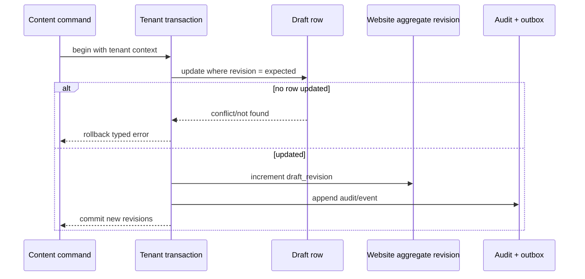
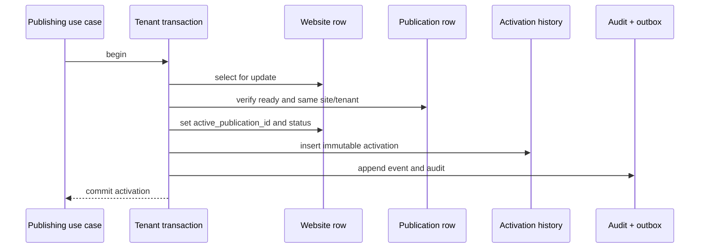

# Specification 02: Database Design

Status: Approved
Approved by: Architecture owner
Prerequisite: [Specification 01 — Monorepo and Package Structure](./01-monorepo-package-structure.md) (approved)
Architecture source: [`ARCHITECTURE.md`](../../ARCHITECTURE.md)
Implementation authorization: User-approved
Next specification after approval: SDK implementation

## 1. Purpose and scope

This specification defines the PostgreSQL persistence model for the frozen Website Factory architecture. It covers relational ownership, tenant isolation, mutable draft storage, immutable publication metadata, template/component/plugin catalogs, domains, media, jobs, outbox events, audit records, idempotency, constraints, indexes, transactions, retention, migrations, repository boundaries, and database testing.

It does not define the complete Template SDK TypeScript API, publication compilation algorithm, rendering algorithm, provider selection, or production code. JSON document shapes referenced here remain governed by their versioned contracts and will be detailed in later specifications.

## 2. Database responsibilities

PostgreSQL is the authoritative system of record for:

- organizations, users, memberships, roles, permissions, and sessions owned by the Factory;
- clients and websites;
- mutable versioned drafts for website settings, pages, sections, navigation, themes, and SEO;
- template/plugin catalog state and immutable artifact references;
- publication lifecycle, activation pointer, and immutable artifact metadata;
- domains, ownership verification attempts, and certificate bindings;
- media metadata, variants, folders, and references;
- durable jobs when the selected job adapter uses PostgreSQL, plus provider-neutral job state;
- transactional outbox records, idempotency records, and immutable audit events.

PostgreSQL is not responsible for:

- media bytes, template bundles, or publication snapshot bytes; these live in object/artifact storage;
- rendered HTML caches or distributed rate-limit counters; these live behind cache ports;
- interpreting template-specific JSON content;
- embedding concrete template component implementations;
- storing arbitrary provider secrets in plaintext;
- serving as an analytics warehouse.

## 3. Design principles

1. Every tenant-owned row carries `organization_id`, including children whose tenant could be derived through a parent.
2. Application authorization is primary; PostgreSQL row-level security (RLS) is mandatory defense in depth.
3. Runtime identity uses immutable opaque IDs. Names and slugs are mutable attributes.
4. Mutable drafts and immutable publications never share lifecycle tables.
5. JSONB is used only for versioned, size-bounded generic documents; ownership, lifecycle, ordering, uniqueness, and references remain relational.
6. Cross-module state changes use explicit transactions and write outbox/audit records atomically.
7. Foreign keys, checks, and unique indexes enforce invariants that must survive application bugs.
8. Soft deletion is used only where recovery, auditability, or reference retention requires it. Immutable history is never “soft updated.”
9. Schema migrations are forward-only, reviewed, repeatable, observable, and compatible with rolling application deployment.
10. Public rendering reads only active immutable publication metadata and artifacts, never draft rows.

## 4. Technology and conventions

- PostgreSQL 16 or later is the initial supported database family.
- Prisma owns ordinary schema/client generation and migrations where expressible.
- Reviewed SQL migration files supplement Prisma for RLS, partial/covering indexes, triggers, constraints, partitioning, and PostgreSQL-specific behavior.
- All table and column names use `snake_case`; Prisma model/field mappings may use TypeScript conventions.
- All timestamps use `timestamptz`, are stored in UTC, and are supplied by the database for persistence timestamps.
- IDs use UUIDv7-compatible UUID values generated by an approved application `IdGenerator` unless a database-generated ID is required for operational ingestion. The database type is `uuid`.
- Versions that participate in numeric comparison use integers. Semantic versions are stored as validated text plus normalized comparison fields only if later required.
- JSON documents use `jsonb`; arbitrary `json` is forbidden.
- User-visible order uses lexicographically sortable `order_key varchar(128)`, not integer array positions.
- Hostnames use normalized ASCII/IDNA lowercase values in a constrained text column.
- Emails are normalized in an explicit column; display/original values may be stored separately.
- Money, billing, and marketplace licensing are out of scope.

## 5. Database package directory structure

```text
packages/database/
├─ prisma/
│  ├─ schema.prisma
│  └─ migrations/
│     └─ <timestamp>_<name>/
│        ├─ migration.sql
│        └─ README.md                 # required for non-trivial/online migrations
├─ sql/
│  ├─ rls/
│  ├─ functions/
│  ├─ checks/
│  └─ verification/                  # read-only post-migration assertions
├─ src/
│  ├─ index.ts
│  ├─ client/
│  │  ├─ create-database-client.ts
│  │  └─ database-health.ts
│  ├─ transactions/
│  │  ├─ prisma-transaction-runner.ts
│  │  └─ tenant-transaction-context.ts
│  ├─ repositories/
│  │  ├─ identity/
│  │  ├─ tenancy/
│  │  ├─ clients/
│  │  ├─ websites/
│  │  ├─ content/
│  │  ├─ templates/
│  │  ├─ plugins/
│  │  ├─ publishing/
│  │  ├─ domains/
│  │  ├─ media/
│  │  ├─ jobs/
│  │  ├─ outbox/
│  │  ├─ audit/
│  │  └─ idempotency/
│  ├─ mappers/                        # database rows ↔ owned DTOs
│  ├─ errors/
│  ├─ generated/                      # Prisma client; never manually edited
│  └─ internal/
├─ tests/
│  ├─ integration/
│  ├─ rls/
│  ├─ concurrency/
│  ├─ migrations/
│  ├─ repositories/
│  └─ fixtures/
├─ package.json
├─ README.md
└─ tsconfig.json
```

Feature packages own repository interfaces. `@factory/database` implements them. Generated Prisma models MUST NOT cross the package boundary.

### 5.1 Internal components

- Database client factory: creates role-specific, instrumented Prisma/database clients from validated configuration.
- Tenant transaction runner: establishes `SET LOCAL` tenant/actor/correlation context, isolation, retry policy, and commit/rollback boundaries.
- Feature repository adapters: implement only feature-owned repository ports with explicit selects and row-to-DTO mapping.
- Row mappers: translate database values to public feature DTOs and reject corrupt persisted state.
- Constraint error translator: maps named PostgreSQL constraints and Prisma conditions to stable application errors.
- Migration assets: forward migrations, supplemental RLS/functions/check SQL, explanatory runbooks, and read-only verification queries.
- Database health adapter: separate liveness from readiness and reports safe operational diagnostics.
- Test infrastructure: isolated database lifecycle, migration runner, tenant-context fixtures, and repository/adapter contract harnesses.

These components are private except for the factories and adapter bundle described in §19. They do not become a second application layer and contain no template-specific policy.

## 6. Shared column patterns

### 6.1 Mutable tenant entity

Typical mutable tenant tables contain:

```text
id                uuid primary key
organization_id   uuid not null
created_at        timestamptz not null default transaction_timestamp()
created_by        uuid null
updated_at        timestamptz not null default transaction_timestamp()
updated_by        uuid null
revision          bigint not null default 1 check (revision > 0)
deleted_at        timestamptz null        # only where soft deletion is specified
deleted_by        uuid null
```

Application updates MUST include `revision = expected_revision` and increment it. `updated_at` is set in the update statement. A generic automatic update trigger is not used because it obscures writes and complicates bulk migrations.

### 6.2 Immutable record

Immutable history/event/artifact tables contain identity, tenant when applicable, creation metadata, version/integrity fields, and no general `updated_at`. Mutable operational delivery fields, such as outbox claim state, are isolated from immutable payload meaning.

### 6.3 Foreign-key tenant integrity

Where child and parent are tenant-owned, the parent exposes `unique (organization_id, id)`, and the child uses a composite foreign key:

```sql
foreign key (organization_id, website_id)
  references websites (organization_id, id)
```

This prevents a row from pointing to another tenant even if RLS or application scope is wrong.

### 6.4 Delete behavior

- `RESTRICT` is the default for business records and immutable references.
- `CASCADE` is allowed only for true owned operational children that cannot exist independently, such as a verification attempt under a deleted pending domain, and must be documented.
- `SET NULL` is allowed for actor references so user deletion/deactivation does not destroy history.
- Tenant deletion is a separate audited retention workflow, not a broad SQL cascade.

## 7. Schema ownership overview

| Module        | Tables                                                                                                       |
| ------------- | ------------------------------------------------------------------------------------------------------------ |
| Identity/Auth | `users`, `auth_identities`, `sessions`, `roles`, `permissions`, `role_permissions`                           |
| Tenancy       | `organizations`, `memberships`, `membership_roles`                                                           |
| Clients       | `clients`                                                                                                    |
| Websites      | `websites`, `website_locales`, `website_settings_drafts`                                                     |
| Content       | `page_drafts`, `section_drafts`, `navigation_drafts`, `navigation_node_drafts`, `theme_drafts`, `seo_drafts` |
| Templates     | `template_catalog_entries`, `template_versions`                                                              |
| Components    | `component_catalog_entries`                                                                                  |
| Plugins       | `plugin_catalog_entries`, `plugin_versions`, `plugin_installations`                                          |
| Publishing    | `publications`, `publication_artifacts`, `publication_activations`, `preview_snapshots`                      |
| Domains       | `domains`, `domain_verification_attempts`, `certificate_bindings`                                            |
| Media         | `media_folders`, `media_assets`, `media_variants`, `media_references`                                        |
| Jobs          | `jobs`, `job_attempts`                                                                                       |
| Platform      | `outbox_events`, `audit_events`, `idempotency_records`                                                       |

The final Prisma model spelling may combine physical naming through `@@map`, but physical tables and ownership follow this specification.

## 8. Identity, authentication, and tenancy

### 8.1 `organizations`

Purpose: root tenant and lifecycle boundary.

Columns:

| Column                     | Type         | Rules                                                 |
| -------------------------- | ------------ | ----------------------------------------------------- |
| `id`                       | uuid         | PK, immutable                                         |
| `slug`                     | varchar(80)  | normalized, mutable, active unique                    |
| `name`                     | varchar(200) | non-empty                                             |
| `status`                   | varchar(24)  | `active`, `suspended`, `archived`, `deletion_pending` |
| `default_locale`           | varchar(35)  | validated BCP 47 form at application boundary         |
| `plan_key`                 | varchar(80)  | generic quota policy key, not billing state           |
| `created_at`, `updated_at` | timestamptz  | required                                              |
| `revision`                 | bigint       | optimistic concurrency                                |
| `archived_at`              | timestamptz  | nullable                                              |

Constraints/indexes:

- primary key on `id`;
- partial unique index on `lower(slug)` while `archived_at is null`;
- status/timestamp consistency check.

Organizations are not subject to ordinary tenant RLS because they establish tenant identity. Access is through membership-scoped repository queries and privileged system maintenance roles.

### 8.2 `users`

Purpose: Factory user identity independent of external auth provider.

Columns: `id`, `display_name`, `primary_email`, `normalized_email`, `status`, `created_at`, `updated_at`, `revision`, `last_seen_at`. Email uniqueness policy applies to verified sign-in identity, not merely display data.

`users` is global and not tenant-owned. User lookup is limited to auth flows and membership-scoped projections.

### 8.3 `auth_identities`

Columns: `id`, `user_id`, `provider_key`, `provider_subject`, `email_at_link`, `created_at`, `last_authenticated_at`, `disabled_at`.

Constraints:

- unique `(provider_key, provider_subject)`;
- unique `(user_id, provider_key, provider_subject)`;
- provider tokens/secrets are not stored here unless an approved encrypted credential adapter is later specified.

### 8.4 `sessions`

Used only if the selected auth adapter requires Factory session persistence. Columns: `id`, `user_id`, `token_hash`, `created_at`, `expires_at`, `last_seen_at`, `revoked_at`, `ip_hash`, `user_agent_summary`. Only a keyed/session token hash is persisted. Index `(token_hash)` unique and `(user_id, expires_at)`.

### 8.5 `memberships`

Columns: `id`, `organization_id`, `user_id`, `status`, `invited_email`, `created_at`, `created_by`, `accepted_at`, `suspended_at`, `revision`.

Constraints:

- unique active membership `(organization_id, user_id)` when `user_id is not null`;
- invite state checks ensure `invited_email`/`accepted_at` align with status;
- composite unique `(organization_id, id)` for tenant-safe children.

### 8.6 Roles and permissions

`permissions` is a platform-owned catalog: `id`, immutable `key`, `description`, `introduced_version`, `retired_at`. Permission keys are code-defined platform contracts, seeded idempotently.

`roles`: `id`, `organization_id`, `key`, `name`, `description`, `is_system`, `created_at`, `updated_at`, `revision`, `archived_at`. Unique active `(organization_id, key)`.

`role_permissions`: `organization_id`, `role_id`, `permission_id`, `created_at`, `created_by`; composite PK and tenant-safe role FK.

`membership_roles`: `organization_id`, `membership_id`, `role_id`, `created_at`, `created_by`; composite PK, with both tenant-safe FKs.

Effective permissions are computed from active membership roles; no comma-separated or JSON permission list is stored on membership.

## 9. Clients and websites

### 9.1 `clients`

Columns: standard mutable tenant fields plus `name`, `contact_name`, `contact_email`, `contact_phone`, `notes`, `archived_at`.

Indexes: `(organization_id, archived_at, name)`, optional trigram search index only after measured need. Notes have an explicit byte limit and are plain/sanitized rich text according to the application contract.

### 9.2 `websites`

Purpose: mutable website identity/lifecycle, not rendered content.

Columns:

| Column                  | Type         | Rules                                                                     |
| ----------------------- | ------------ | ------------------------------------------------------------------------- |
| `id`, `organization_id` | uuid         | PK and tenant scope                                                       |
| `client_id`             | uuid         | nullable tenant-safe FK                                                   |
| `name`                  | varchar(200) | display only                                                              |
| `status`                | varchar(24)  | `draft`, `published`, `unpublished`, `archived`                           |
| `template_id`           | varchar(160) | immutable SDK TemplateId value                                            |
| `template_version`      | varchar(64)  | exact version, FK to catalog composite identity through repository/DB key |
| `default_locale`        | varchar(35)  | must exist in website locales before publish                              |
| `draft_revision`        | bigint       | aggregate revision for freeze/publish                                     |
| `active_publication_id` | uuid         | nullable; constrained to same website/tenant via composite FK             |
| audit fields            | —            | mutable pattern                                                           |
| `archived_at`           | timestamptz  | nullable                                                                  |

`active_publication_id` is the authoritative public activation pointer. `status = published` requires it; other statuses may retain it only for explicit unpublish/rollback semantics defined in the publishing specification. To avoid circular creation dependencies, its composite FK is added after `publications` exists and is deferrable where necessary.

Indexes:

- `(organization_id, status, updated_at desc)`;
- `(organization_id, client_id)`;
- `(organization_id, template_id, template_version)`;
- unique `(organization_id, id)`.

### 9.3 `website_locales`

Columns: `organization_id`, `website_id`, `locale`, `is_default`, `fallback_locale`, `created_at`, `updated_at`. Composite PK `(website_id, locale)`, tenant-safe FK, one default locale per website via partial unique index, fallback cannot equal locale. Cross-locale fallback-cycle validation is performed by application logic and publication validation.

### 9.4 `website_settings_drafts`

One mutable settings document per website/locale scope as defined by the SDK:

`id`, `organization_id`, `website_id`, nullable `locale`, `schema_version`, `content_json`, `content_size_bytes`, `revision`, audit fields.

Unique `(website_id, locale)` with a normalized uniqueness strategy for null/global scope (partial indexes). Check positive schema version and configured byte/depth validation at repository boundary.

## 10. Mutable content drafts

Draft rows are independently revisioned and contribute to `websites.draft_revision`. Every successful content mutation increments the row revision and the website aggregate draft revision within one transaction. This lets publishing freeze a stable aggregate revision while preserving fine-grained editor conflicts.

### 10.1 `page_drafts`

Columns:

- `id`: immutable PageId instance;
- `organization_id`, `website_id`;
- `page_type_id`: immutable SDK PageTypeId;
- `locale`;
- `title`: editor/display value;
- `slug`: normalized route attribute, never identity;
- `status`: `active`, `hidden`, `deleted` (or soft-delete timestamp per final content state machine);
- `order_key`;
- `schema_version` and optional generic `settings_json`;
- `revision`, audit fields, `deleted_at`/`deleted_by`.

Constraints/indexes:

- tenant-safe website FK;
- unique live route slug `(website_id, locale, slug)` where not deleted;
- unique `(organization_id, id)`;
- `(website_id, locale, order_key)`;
- slug length/non-empty checks; canonical route conflict validation remains compiler responsibility because templates may own non-page routes.

### 10.2 `section_drafts`

Columns: `id` (SectionId), `organization_id`, `website_id`, `page_id`, `section_type_id`, `schema_version`, `content_json`, `content_size_bytes`, `order_key`, `visibility_json`, `revision`, audit/delete fields.

Constraints:

- composite tenant-safe page FK includes `(organization_id, website_id, page_id)`; parent must expose matching unique key;
- unique live `(page_id, order_key)`;
- positive schema version and size;
- content is opaque to SQL and validated using the exact template schema before persistence.

Blocks and widgets remain nested JSON inside section content initially unless the SDK specification proves independently addressable/editor-concurrent instances are required for Doctor/Clinic. Their immutable IDs remain present in the document contract. This follows the frozen “implement only with concrete use case” rule and does not remove the Block/Widget SDK layers.

### 10.3 `navigation_drafts`

Represents a template-defined navigation structure instance.

Columns: `id` (NavigationId), `organization_id`, `website_id`, `navigation_definition_id`, nullable `locale`, `revision`, audit fields. Unique `(website_id, navigation_definition_id, locale)` using null/global partial indexes.

### 10.4 `navigation_node_drafts`

Columns: `id` (NavigationNodeId), `organization_id`, `website_id`, `navigation_id`, nullable `parent_id`, `node_type`, nullable `page_id`, `label_json`, `target_json`, `visibility_json`, `order_key`, `revision`, audit/delete fields.

Rules:

- parent must belong to same navigation/tenant/website via composite self-FK;
- unique live `(navigation_id, parent_id, order_key)` with separate null-parent index;
- page reference, when present, is tenant-safe;
- maximum depth, allowed page type, ordering, visibility, and localization behavior are SDK/application validations, not hardcoded SQL rules;
- cycles are prevented in application commands and revalidated by publication compilation. A deferred constraint trigger MAY be used only if later performance/testing proves it reliable.

### 10.5 `theme_drafts`

Columns: `id` (ThemeId), `organization_id`, `website_id`, nullable `locale`, `theme_schema_version`, `tokens_json`, `content_size_bytes`, `revision`, audit fields. Unique website/global-locale scope. Tokens are structured semantic values validated against template theme schema; raw CSS is rejected before persistence.

### 10.6 `seo_drafts`

Columns: `id`, `organization_id`, `website_id`, nullable `page_id`, `locale`, `schema_version`, `seo_json`, `content_size_bytes`, `revision`, audit fields.

Unique scopes distinguish website-level SEO from page-level SEO using partial unique indexes. Structured data remains JSON but passes generic safety and template/SEO contract validation.

## 11. Template and component catalogs

### 11.1 `template_catalog_entries`

One stable row per TemplateId:

`id` (internal UUID), `template_id` (stable namespaced text), `display_name`, `author`, `description`, `category`, `lifecycle_status`, `created_at`, `updated_at`, `revision`.

Unique `template_id`. Mutable display metadata never identifies artifacts.

### 11.2 `template_versions`

One immutable catalog identity per template exact version, with controlled lifecycle/status fields.

Columns:

- `id` UUID (TemplateVersionId);
- `template_catalog_entry_id`, `template_id`, `template_version`;
- `artifact_uri`, `artifact_hash`, `artifact_size_bytes`;
- `sdk_version`, `minimum_factory_version`, nullable `maximum_factory_version`;
- `minimum_renderer_version`;
- `content_schema_version`, `theme_schema_version`, `publication_snapshot_version`;
- `capabilities_json`, `manifest_json`, `validation_report_json`;
- `validation_status`: `pending`, `valid`, `invalid`, `quarantined`;
- `lifecycle_status`: `discovered`, `validating`, `ready`, `deprecated`, `retired`;
- `discovered_at`, `validated_at`, `ready_at`, `deprecated_at`, `retired_at`;
- artifact/signing provenance fields reserved only where populated by implemented first-party source validation.

Constraints/indexes:

- unique `(template_id, template_version)`;
- unique `artifact_hash` only if artifacts are globally content-addressed; otherwise indexed, not assumed globally unique;
- positive schema versions and artifact size;
- lifecycle timestamp consistency checks;
- manifest/version fields are duplicated relationally intentionally so compatibility queries do not parse JSON;
- immutable contract/artifact fields cannot be changed after valid/ready; lifecycle transitions update only lifecycle columns.

### 11.3 `component_catalog_entries`

Derived index, rebuildable from validated artifacts.

Columns: `id`, `artifact_kind` (`template`, `plugin`), `artifact_id`, `owner_id`, `owner_version`, `component_kind` (`widget`, `block`, `section`, `theme`, `plugin`), `component_id`, `display_name`, `description`, `category`, `search_text`, `metadata_json`, `schema_version`, `indexed_at`.

Unique `(artifact_kind, artifact_id, component_kind, component_id)`. Indexes on kind/category and a PostgreSQL full-text search vector. No business record foreign key points to this derived table; authoritative references point to immutable template/plugin artifacts and component IDs.

Re-index is transactional per artifact: write new index set to staging/temp context, replace that artifact's entries atomically.

## 12. Plugin catalog and installations

### 12.1 `plugin_catalog_entries` and `plugin_versions`

Mirror the identity/version separation used by templates: stable PluginId entry plus immutable exact version/artifact/manifest/compatibility/capability validation. Fields not exercised by an approved Doctor/Clinic plugin scenario remain nullable contract placeholders or are deferred from physical creation; marketplace fields are not added.

### 12.2 `plugin_installations`

Tenant-owned installation state:

`id`, `organization_id`, nullable `website_id`, `plugin_id`, `plugin_version`, `status`, `config_schema_version`, `config_json`, encrypted `secret_ref` (reference only), `revision`, audit fields, `disabled_at`.

Unique active scope `(organization_id, website_id, plugin_id)`, with separate organization-scope null handling. Configuration is schema-validated. Provider secret material lives behind a secrets adapter and is referenced by opaque ID.

If no first-release Doctor/Clinic plugin is approved, physical plugin runtime tables MAY be deferred while their migrations/interfaces remain designed; template-independent core tables are not forced to depend on them.

## 13. Publications and previews

### 13.1 `publications`

Immutable logical publication record.

Columns:

| Column                                | Type        | Rules                                                   |
| ------------------------------------- | ----------- | ------------------------------------------------------- |
| `id`                                  | uuid        | PublicationId PK                                        |
| `organization_id`, `website_id`       | uuid        | tenant-safe ownership                                   |
| `sequence_number`                     | bigint      | monotonic per website                                   |
| `source_draft_revision`               | bigint      | exact frozen website revision                           |
| `template_id`, `template_version`     | text        | exact artifact identity                                 |
| `template_artifact_hash`              | varchar     | integrity binding                                       |
| `snapshot_schema_version`             | int         | positive                                                |
| `content_schema_version`              | int         | positive                                                |
| `theme_schema_version`                | int         | positive                                                |
| `status`                              | varchar     | `compiling`, `validating`, `ready`, `failed`, `retired` |
| `created_at`, `created_by`            | —           | immutable provenance                                    |
| `ready_at`, `failed_at`, `retired_at` | timestamptz | state timestamps                                        |
| `failure_code`                        | varchar     | safe stable code, nullable                              |

Publication identity/provenance is immutable. Only lifecycle fields transition according to the publishing state machine. Unique `(website_id, sequence_number)` and `(organization_id, id)`. Index `(website_id, status, created_at desc)`.

### 13.2 `publication_artifacts`

One or more immutable artifacts per publication, initially one canonical snapshot.

Columns: `id`, `organization_id`, `publication_id`, `artifact_kind`, `storage_uri`, `content_hash`, `byte_size`, `content_type`, `compression`, `snapshot_schema_version`, `created_at`.

Unique `(publication_id, artifact_kind)` and indexed `content_hash`. Artifact bytes are written before the database record becomes ready, then integrity/smoke validation completes. Orphan cleanup handles storage writes that precede failed DB commits.

### 13.3 `publication_activations`

Immutable activation/rollback history:

`id`, `organization_id`, `website_id`, nullable `from_publication_id`, `to_publication_id`, `action` (`publish`, `rollback`, `republish`), `activated_at`, `activated_by`, `correlation_id`.

Activation transaction locks the website row, verifies target `ready` and same website/tenant, updates `websites.active_publication_id` and status, inserts activation history, audit, and outbox event. Unique idempotency is handled by the command idempotency record.

### 13.4 `preview_snapshots`

Temporary immutable snapshot metadata:

`id` (PreviewSnapshotId), `organization_id`, `website_id`, `source_draft_revision`, exact template/version/hash, `artifact_uri`, `content_hash`, `snapshot_schema_version`, `created_at`, `created_by`, `expires_at`, `status` (`ready`, `expired`, `failed`), nullable `failure_code`.

Preview authorization token hashes/claims are not stored unless revocation requirements later demand it. Index `(expires_at)` for GC and `(organization_id, website_id, created_at desc)` for authorized status views. Preview artifacts cannot be referenced by `websites.active_publication_id` due to separate identity/table and FK.

## 14. Domain management

### 14.1 `domains`

Columns:

- `id`, `organization_id`, `website_id`;
- `hostname_normalized` (ASCII IDNA lowercase, no port/trailing dot);
- `hostname_display`;
- `kind`: `subdomain` or `custom`;
- `status`: `pending`, `verifying`, `verified`, `connecting`, `active`, `failed`, `disconnected`;
- `verification_method`, `current_challenge_hash`, `challenge_expires_at`;
- `verified_at`, `connected_at`, `last_checked_at`;
- `failure_code`;
- mutable revision/audit fields, `released_at`.

Constraints/indexes:

- globally unique active/reserved `hostname_normalized` where `released_at is null`;
- tenant-safe website FK;
- unique `(organization_id, id)`;
- status/timestamp checks;
- reserved platform hostnames are rejected in domain policy and additionally protected by seeded reservation records or a database check strategy decided with deployment configuration.

### 14.2 `domain_verification_attempts`

Immutable attempts: `id`, `organization_id`, `domain_id`, `attempted_at`, `method`, `challenge_version`, `result`, `observed_json` (size-bounded and redacted), `failure_code`, `provider_request_id`. Indexed `(domain_id, attempted_at desc)` and retention-managed.

### 14.3 `certificate_bindings`

Provider-neutral metadata: `id`, `organization_id`, `domain_id`, `provider_key`, `provider_binding_id`, `status`, `requested_at`, `issued_at`, `expires_at`, `last_checked_at`, `failure_code`, `revision`. Unique active `(domain_id)` and unique `(provider_key, provider_binding_id)`.

Private keys/certificate secrets are never stored in application tables.

## 15. Media library

### 15.1 `media_folders`

Columns: `id`, `organization_id`, nullable `parent_id`, `name`, `order_key`, revision/audit/delete fields. Composite tenant-safe self-FK, unique live sibling name using normalized comparison, cycle prevention in application plus periodic integrity verification.

### 15.2 `media_assets`

Columns:

- `id`, `organization_id`, nullable `folder_id`;
- `status`: `pending_upload`, `quarantined`, `scanning`, `processing`, `ready`, `rejected`, `deleted`;
- `kind`: `image`, `video`, `document`, `icon`;
- `original_filename`, `storage_key`, `content_hash`, `declared_content_type`, `detected_content_type`, `byte_size`;
- generic `width`, `height`, `duration_ms`, `metadata_json`;
- `scan_status`, `scan_completed_at`, `rejection_code`;
- audit/revision/delete fields.

Constraints/indexes:

- unique storage key;
- positive/nonnegative sizes/dimensions;
- ready implies successful scan and detected allowed type;
- `(organization_id, status, created_at desc)`, `(organization_id, folder_id, created_at desc)`, and content hash index for controlled dedupe hints—not automatic cross-tenant sharing.

### 15.3 `media_variants`

Immutable generated variant metadata: `id`, `organization_id`, `media_asset_id`, `variant_key`, `storage_key`, `content_hash`, `content_type`, `byte_size`, nullable dimensions/duration, `created_at`. Unique `(media_asset_id, variant_key)` and unique storage key.

### 15.4 `media_references`

Generic reference graph used to prevent premature deletion:

`id`, `organization_id`, `media_asset_id`, `source_kind`, `source_id`, `source_path`, `publication_id` nullable, `created_at`.

`source_kind` is a controlled platform enum such as draft section, theme, SEO, plugin config, or publication. `source_id` is an opaque immutable ID; polymorphic database FKs are not possible, so reference writers are owned services and periodic consistency checks verify sources. Publication-pinned references have an actual tenant-safe `publication_id` FK. Unique reference identity prevents duplicates.

## 16. Jobs, outbox, audit, and idempotency

### 16.1 `jobs`

Provider-neutral durable job record; it may also be the broker for the initial PostgreSQL adapter.

Columns: `id`, nullable `organization_id`, `type`, `version`, `payload_json`, `payload_size_bytes`, `status`, `priority`, `available_at`, `attempt_count`, `max_attempts`, nullable `locked_at`, `lock_owner`, `lock_expires_at`, `deduplication_key`, `correlation_id`, `created_at`, `completed_at`, `failed_at`, `last_error_code`.

Indexes for PostgreSQL claim:

- partial `(priority desc, available_at, created_at)` where status is queued/retryable;
- `(lock_expires_at)` for stale claims;
- partial unique `(type, deduplication_key)` for active states where key is present;
- tenant/status history index.

Claiming uses `FOR UPDATE SKIP LOCKED` in a short transaction. Business work does not hold the claim transaction open. Lease renewal and idempotent handlers protect duplicate execution.

### 16.2 `job_attempts`

Immutable attempt history: `id`, `job_id`, `attempt_number`, `worker_id`, `started_at`, `finished_at`, `outcome`, `error_code`, redacted `error_details_json`, `trace_id`. Unique `(job_id, attempt_number)`.

### 16.3 `outbox_events`

Columns:

- `id` EventId;
- nullable `organization_id`;
- `event_type`, `event_version`;
- `aggregate_type`, `aggregate_id`, `aggregate_revision`;
- `payload_json`, `payload_size_bytes`;
- `occurred_at`, `actor_json`, `correlation_id`, `causation_id`;
- operational delivery columns: `status`, `available_at`, `attempt_count`, `locked_at`, `lock_owner`, `lock_expires_at`, `published_at`, `last_error_code`.

The event fact fields are immutable. Delivery fields may change. Events are appended inside the same transaction as aggregate state. Dispatch also uses lease/skip-locked semantics and at-least-once delivery.

Indexes: claim partial index, `(aggregate_type, aggregate_id, occurred_at)`, `(organization_id, occurred_at desc)`, `correlation_id`.

### 16.4 `audit_events`

Append-only: `id`, nullable `organization_id`, `actor_type`, nullable `actor_id`, `action`, `resource_type`, nullable `resource_id`, `occurred_at`, `correlation_id`, `ip_hash`, `user_agent_summary`, `before_summary_json`, `after_summary_json`, `metadata_json`, `retention_class`.

Audit payloads are size-bounded, redacted summaries—not full sensitive content dumps. Ordinary application roles have INSERT/SELECT-by-policy but no UPDATE/DELETE. Retention deletion uses a privileged audited maintenance role according to policy.

### 16.5 `idempotency_records`

Columns: `id`, `organization_id`, `scope`, `key_hash`, `request_hash`, `status` (`in_progress`, `succeeded`, `failed_retryable`), `response_code`, `response_json`, `resource_id`, `created_at`, `expires_at`, `completed_at`.

Unique `(organization_id, scope, key_hash)`. A reused key with different request hash is a conflict. Secrets/raw keys are not persisted. Transactions either reserve the key with the business mutation strategy specified by each command or safely recover an expired in-progress record.

## 17. Row-level security and connection roles

### 17.1 Roles

Minimum database roles:

- `factory_migrator`: DDL/migrations only; never used by apps.
- `factory_app`: dashboard/worker tenant transactions; subject to RLS.
- `factory_renderer`: read-only access to domain/publication/template artifact metadata required by delivery; no draft access.
- `factory_maintenance`: tightly controlled retention/repair operations.

Provider-specific role provisioning is deployment configuration, but privilege intent is normative.

### 17.2 Tenant transaction context

Every tenant transaction sets local settings through parameterized SQL:

```sql
set local app.organization_id = '<uuid>';
set local app.actor_id = '<uuid-or-system-id>';
set local app.correlation_id = '<value>';
```

Adapters use `set_config(..., true)` with bound parameters, never string concatenation. `SET LOCAL` scopes values to the current transaction, preventing pooled-connection leakage. Tenant repository operations outside a transaction are forbidden.

### 17.3 Tenant policies

Every tenant-owned table enables and forces RLS. Baseline policy concept:

```sql
using (organization_id = nullif(current_setting('app.organization_id', true), '')::uuid)
with check (organization_id = nullif(current_setting('app.organization_id', true), '')::uuid)
```

Absence or invalidity of context denies access. Table owners used by applications do not bypass RLS. System jobs enumerate organizations through a privileged, narrow system query, then execute tenant work under that tenant context rather than disabling RLS broadly.

Renderer uses separate explicit policies/views for active domain/publication reads. It cannot select draft tables even when a tenant setting is present.

### 17.4 Global tables

Global catalogs (`permissions`, template/plugin catalogs as applicable) use explicit read grants and restricted writer roles/use cases rather than tenant RLS. Global `users` access is encapsulated through scoped repository queries. No application receives blanket public schema privileges.

## 18. Transactions and consistency

### 18.1 Isolation levels

- Ordinary scoped reads/writes: PostgreSQL `READ COMMITTED` plus optimistic revision checks.
- Publish freeze/activation, domain reservation, unique lifecycle transitions: row locks and/or `SERIALIZABLE` where the use-case spec proves it necessary.
- Serializable transactions retry only serialization/deadlock failures with bounded attempts and idempotent command context.

### 18.2 Draft mutation transaction



### 18.3 Publication activation transaction



Artifact storage is not transactional with PostgreSQL. Publishing uses state transitions and orphan cleanup: write immutable artifact, verify hash, insert/advance DB records, then activate only after all gates pass. A failure never changes the active publication pointer.

### 18.4 Domain reservation

Global hostname uniqueness is guaranteed by the partial unique index. The command attempts reservation in a transaction; unique violation is translated to a domain conflict without revealing tenant ownership.

## 19. Public interfaces of `@factory/database`

The package exports infrastructure factories, not feature-specific domain contracts:

```ts
interface DatabaseClientOptions {
  connectionString: SecretString;
  applicationName: string;
  pool: PoolOptions;
}

interface TenantTransactionOptions {
  organizationId: OrganizationId;
  actorId: ActorId;
  correlationId: string;
  isolation?: TransactionIsolation;
}

interface DatabaseHealth {
  liveness(): Promise<HealthResult>;
  readiness(): Promise<HealthResult>;
}

function createDatabaseAdapters(config: DatabaseConfig): DatabaseAdapters;
```

`DatabaseAdapters` is consumed only by app composition roots and exposes implementations assignable to feature-owned ports. Consumers type against `@factory/content`, `@factory/publishing`, and other port interfaces, not against Prisma.

No raw query escape hatch is exported globally. Specialized SQL remains private to an owning repository adapter and is tested.

## 20. Repository implementation rules

1. Repository methods accept tenant/request context through transaction scope, not as optional query filters.
2. DTO mapping selects explicit columns; `select *` and returning raw Prisma objects are forbidden in public adapters.
3. Reads distinguish absent, inaccessible, and conflict without leaking cross-tenant existence.
4. Mutations include expected revision when changing mutable editor/business state.
5. List queries use keyset/cursor pagination, deterministic ordering, and capped limits.
6. JSON is parsed/validated at the feature/contract boundary both before write and after read; corrupted persisted JSON becomes an integrity error.
7. Bulk operations have explicit maximum size and use bounded batches.
8. All queries carry application name, correlation/tracing instrumentation where supported, and slow-query measurement.
9. Repositories do not publish broker messages directly; they append outbox events within the transaction.
10. Cache population/invalidation happens outside the state transaction through outbox consumers unless the use case requires a safe post-commit action.

## 21. JSONB policy

Every persisted generic document has:

- an explicit owning entity;
- a schema/contract version column;
- a maximum serialized byte size;
- maximum nesting/collection limits enforced before persistence;
- deterministic validation using the exact template/plugin/publication contract;
- no secrets unless the field explicitly stores an opaque secret reference;
- no HTML/CSS bypass outside approved sanitized schema fields.

JSONB fields are not generally indexed. Add expression/GIN indexes only for a proven Factory-generic query and document the contract path. Template-specific JSON paths MUST NOT appear in Factory migrations, indexes, SQL constraints, reports, or queries.

Large immutable snapshots are stored in artifact storage rather than PostgreSQL JSONB. The database retains their identity, schema version, URI, hash, and size.

## 22. Index strategy

### 22.1 Required index categories

- all primary keys and foreign-key lookup columns;
- tenant-first indexes for common scoped lists;
- partial unique indexes for active/live identities;
- status/available-time indexes for worker claims;
- website/publication/domain resolution indexes;
- retention indexes on expiry/deletion/occurred timestamps;
- full-text component catalog index.

### 22.2 Index review rules

- Every index documents the query/use case it serves.
- Composite ordering matches equality, range, and sort predicates.
- Redundant indexes are rejected during review.
- Production query plans and `pg_stat_statements` drive later additions/removals.
- Large index creation in production uses online/concurrent strategy through a non-transactional reviewed migration step.
- Tenant ID is first where it materially prunes scoped queries; global hostname and immutable artifact lookups are deliberate exceptions.

## 23. Error handling

Database adapters translate:

| PostgreSQL/Prisma condition                   | Application error                                                                              |
| --------------------------------------------- | ---------------------------------------------------------------------------------------------- |
| unique constraint                             | typed `ConflictError` with safe field/code                                                     |
| foreign key violation                         | `ConflictError` or `NotFoundError` based on command contract                                   |
| check/not-null violation from validated input | `IntegrityError` (indicates application/contract defect)                                       |
| optimistic update count zero                  | re-read scoped identity, then `ConflictError` or `NotFoundError`                               |
| serialization/deadlock                        | retryable `DependencyUnavailableError` after bounded internal retries                          |
| connection/timeout                            | retryable `DependencyUnavailableError`                                                         |
| malformed persisted JSON/hash mismatch        | non-retryable `IntegrityError`                                                                 |
| RLS denial/insufficient privilege             | `AuthorizationError` for expected policy denial; otherwise security `IntegrityError` and alert |

Constraint names are stable and mapped explicitly; adapters do not parse localized error text. Raw SQL values, connection strings, query parameters, and cross-tenant identifiers are never exposed to users.

## 24. Extension points

- Feature-owned repository ports permit database adapter replacement/extraction.
- RLS policy templates support new tenant-owned tables with mandatory conformance tests.
- Contract-version columns allow additive document versions and migration readers.
- Artifact references support future global replication without changing publication identity.
- Job broker adapter may move from PostgreSQL to a managed broker while provider-neutral job/idempotency records remain governed by the jobs specification.
- Component catalog search adapter may move to a specialized search engine after measured need; PostgreSQL remains rebuild source metadata, not authoritative artifact source.
- Audit/outbox data may stream to analytics/archival sinks without synchronous feature coupling.

No extension point permits template-specific tables, SQL paths, or columns in Factory core.

## 25. Migration strategy

### 25.1 Migration classes

- Additive: new nullable column/table/index; safe first step.
- Backfill: resumable bounded data job with progress and validation.
- Contract: make non-null, remove old column/index, or tighten constraint only after all readers/writers migrate.
- Data-contract migration: produces a new versioned JSON/snapshot representation; never silently rewrites an active publication artifact.

### 25.2 Expand/migrate/contract sequence

1. Expand schema compatibly.
2. Deploy code capable of reading old/new and writing the intended version.
3. Backfill in bounded resumable batches.
4. Verify counts, nulls, constraints, hashes, and tenant isolation.
5. Switch reads to the new representation.
6. Observe through at least the approved rollback window.
7. Contract old schema in a later deployment.

### 25.3 Migration requirements

- Production migrations never rely on Prisma `db push`.
- Migration SQL is committed and reviewed.
- Destructive or locking statements include an execution/runbook note and rollback/roll-forward plan.
- Set conservative `lock_timeout` and `statement_timeout` per operation.
- Backfills are application/worker jobs, not one enormous migration transaction.
- RLS/grants are applied in the same release as any tenant table before application access.
- Post-migration verification scripts are read-only and run in CI/staging and deployment checks.
- Database backups and restore drills precede destructive contracts.

## 26. Retention, archival, and deletion

Exact durations require the compliance/RPO/RTO owner decision, but mechanisms are fixed:

- sessions and idempotency records expire and are removed in indexed batches;
- preview snapshots and orphaned artifacts expire quickly through worker GC;
- job attempts/outbox delivery state may be archived after operational retention while durable event/audit requirements are respected;
- audit events follow `retention_class` and privileged append-only archival/deletion;
- publication records/artifacts remain while active, rollback-retained, domain/legal/audit policy requires them, or media/template versions reference them;
- media soft deletion waits for no draft/publication references plus retention interval;
- organization erasure is an explicit stateful, audited workflow that removes/anonymizes data by ownership graph and verifies completion.

High-volume append tables (`audit_events`, `outbox_events`, `job_attempts`) are candidates for time partitioning only after measured volume or before a known scale threshold. Partitioning is not required for initial Doctor/Clinic production templates.

## 27. Backup, recovery, and operational safety

- Managed continuous backup/PITR is required for production.
- RPO/RTO values are owner decisions recorded before launch.
- Restore is tested into an isolated environment on a schedule, including object artifact consistency checks.
- Publication artifact storage has versioning/immutability/retention appropriate to last-known-good recovery.
- Database health readiness checks a lightweight query and migration compatibility; it does not run expensive dependency scans.
- Connection pools are independently sized for dashboard, renderer, and worker; renderer has a read-limited role and budget.
- Long-running/idle transactions are monitored and terminated by policy.
- Slow queries, lock waits, deadlocks, pool saturation, replication lag where present, failed migrations, and RLS denials are observable.

## 28. Testing strategy

All database tests run against a real supported PostgreSQL instance via Testcontainers or an equivalent isolated CI service. SQLite/mocked Prisma is insufficient evidence.

### 28.1 Schema and migration tests

- Apply all migrations from empty database.
- Upgrade from every supported release fixture.
- Verify migration checksum/history and post-migration assertions.
- Run expand/backfill/contract compatibility simulations.
- Validate all expected tables, constraints, indexes, RLS policies, grants, and enum/check values.
- Prove a failed migration leaves a known recoverable state.

### 28.2 Tenant isolation tests

For every tenant-owned repository/table:

- tenant A cannot select, insert, update, or delete tenant B rows;
- missing tenant context returns no access/fails closed;
- pooled connection reuse does not leak `SET LOCAL` context;
- composite FKs reject cross-tenant parent references;
- system jobs enter one tenant context at a time;
- renderer role cannot access any draft table;
- global catalog access matches grants.

The suite dynamically discovers tenant tables and fails if a new table lacks an approved RLS classification.

### 28.3 Constraint and concurrency tests

- duplicate hostname reservation races produce one winner;
- duplicate slug races within website/locale produce one winner;
- stale revision update returns conflict and preserves winner data;
- concurrent section reorder maintains unique valid order keys or reports conflict;
- concurrent publication activation is serialized and history matches pointer;
- job/outbox claim with multiple workers never gives an unexpired exclusive lease to two claimants;
- expired lease permits redelivery and idempotent completion;
- idempotency key reuse with changed request hash conflicts;
- domain/navigation/media tenant-safe references reject mismatch.

### 28.4 Repository contract tests

- explicit mapping round trips all supported values;
- corrupted persisted JSON yields integrity error;
- cursor pagination has no duplicates/gaps under defined stable conditions;
- soft-deleted rows follow each query contract;
- unique/FK/database failures map to stable safe errors;
- transaction rollback removes aggregate, audit, and outbox writes together;
- transaction success persists all together.

### 28.5 Publication/draft invariants

- renderer/publication read repositories have no draft dependency;
- preview snapshot ID cannot populate active publication FK;
- failed/incomplete publication cannot activate;
- activation target must share tenant and website;
- publication identity/artifact fields cannot mutate after readiness;
- deleting/deprecating template/media is blocked while retained publication references require it.

### 28.6 Performance tests

Representative generated data validates query plans for:

- hostname → active publication resolution;
- website dashboard lists;
- page/section draft loading;
- template/component search;
- publish history;
- queue/outbox claims;
- audit lists and retention batches.

Tests assert latency/query-count budgets and absence of sequential scans where an approved index should apply, with realistic caveats for small fixtures.

## 29. Implementation order

This order applies only after this database specification and prerequisite feature-contract specifications are approved. It does not authorize production code now.

1. Create database package shell, client/config boundary, migration/test harness, and supported PostgreSQL CI service.
2. Establish extensions if any, UUID conventions, migration ledger, database roles, transaction context functions, and RLS test framework.
3. Add organizations/users/auth identities/memberships/roles/permissions with RLS and repository adapters.
4. Add clients/websites/locales and mutable draft tables with optimistic revisions, tenant-safe FKs, and content repository adapters.
5. Add template/component catalogs and compatibility relational fields.
6. Add publication/artifact/preview/activation tables and renderer read-role views/policies.
7. Add domains and certificate metadata.
8. Add media/folders/variants/references.
9. Add jobs, attempts, outbox, audit, and idempotency infrastructure.
10. Add plugin tables only if an approved Doctor/Clinic scenario requires runtime persistence.
11. Run full tenant, migration, concurrency, repository, publication-invariant, and performance acceptance suites.

Every step adds tables, RLS, grants, constraints, indexes, adapters, migration verification, and tests together. A tenant table is never merged without its RLS classification and isolation tests.

## 30. Future compatibility considerations

- Independent contract-version columns preserve installed template/publication compatibility through Factory and renderer upgrades.
- Immutable publication/artifact rows enable old/new readers to coexist and rollback without data rewrite.
- Additive relational changes plus versioned JSON readers support rolling deployments.
- Tenant-first ownership enables later partitioning or tenant placement without changing IDs.
- Artifact URIs/hashes abstract local-region storage from future replicated storage.
- Provider-neutral domain/certificate/media/job metadata allows adapter replacement.
- Outbox event versions let new consumers coexist with old producers during extraction.
- Repository ports prevent Prisma/generated model coupling from escaping into feature logic.
- Component search is derived and rebuildable, allowing future search-engine migration.
- Global template/plugin catalogs can later gain provenance/signing/marketplace metadata additively without altering active publication identity.
- Active-active multi-region writes, enterprise federation, advanced collaboration, and marketplace billing remain deferred and do not create current tables.

## 31. Known decisions deferred to later specifications

These are intentionally not contradictions:

- exact SDK JSON schemas and validation issue format: Specification 03;
- frozen draft projection and publication snapshot fields: Specification 05;
- renderer cache/read model details: Specification 04;
- exact auth/queue/storage/DNS providers: owner ADRs and adapter specifications;
- blocks/widgets nested versus independently persisted: default nested now; SDK/editor spec may require relational instances only upon a concrete Doctor/Clinic concurrency/use-case proof;
- exact retention durations and RPO/RTO: operational owner decision before launch.

Any later specification that requires a database change MUST amend this document and obtain approval before implementation. It may resolve a proven contradiction but may not silently redesign the frozen architecture.

## 32. Review and approval checklist

- [ ] Every frozen architecture entity has an owner and persistence location or explicit deferral.
- [ ] Every tenant-owned table carries `organization_id`, composite tenant-safe references, forced RLS, and tests.
- [ ] Mutable drafts and immutable publication/preview records are separate.
- [ ] Public activation is one atomic pointer guarded by ready/same-tenant/same-website constraints.
- [ ] Template compatibility dimensions are queryable without JSON parsing.
- [ ] Template-specific content remains opaque, schema-versioned JSON with no Factory SQL paths.
- [ ] Component catalog is derived and rebuildable.
- [ ] Navigation behavior remains SDK-owned while data is generically persisted.
- [ ] Domain uniqueness prevents takeover and leaks no owner.
- [ ] Media deletion respects draft/publication references.
- [ ] Outbox, audit, jobs, and idempotency have distinct responsibilities.
- [ ] Repository interfaces do not leak Prisma models.
- [ ] Migrations support rolling deploys, backfills, and verification.
- [ ] Error translation and transaction boundaries are explicit.
- [ ] Sequence diagrams cover draft mutation and publication activation.
- [ ] Testing proves isolation, constraints, concurrency, migrations, and render/draft separation.
- [ ] Deferred features have not introduced speculative production tables/services.
- [ ] No production code is authorized by this specification.

Approval of this document authorizes creation of Specification 03 (SDK implementation), not database migrations, package scaffolding, or production feature code.
