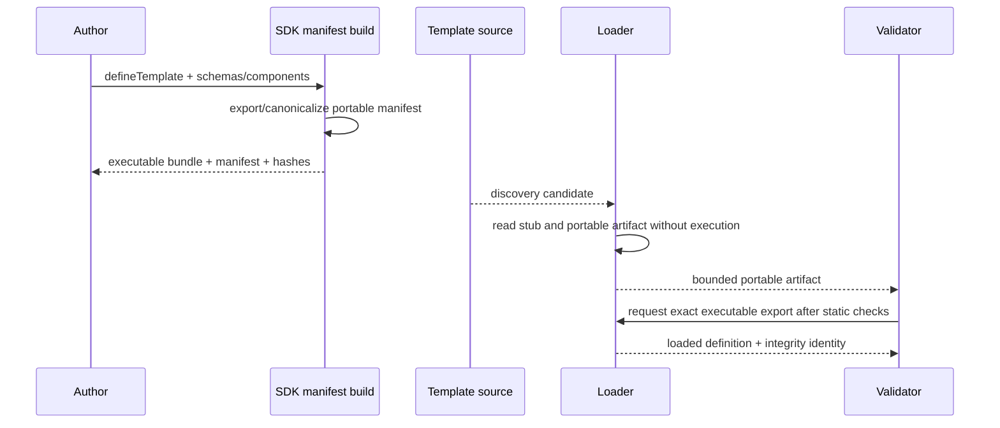
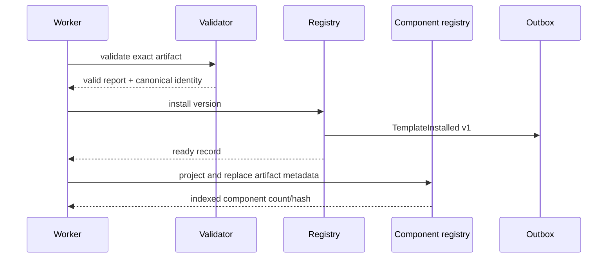
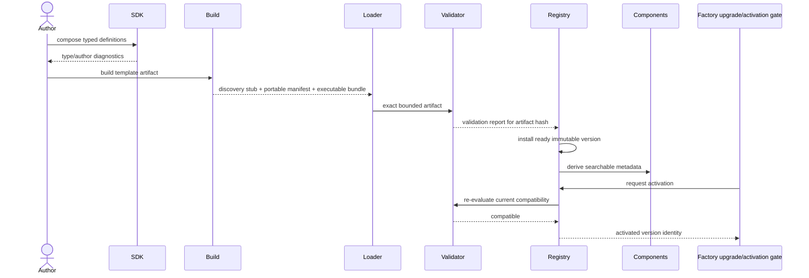

# Specification 03: Template SDK Implementation

Status: Approved
Prerequisites: [Specification 01](./01-monorepo-package-structure.md) and [Specification 02](./02-database-design.md) (approved)
Architecture source: [`ARCHITECTURE.md`](../../ARCHITECTURE.md)
Implementation authorization: User-approved
Next specifications after approval: Rendering pipeline, then publication pipeline

## 1. Purpose and scope

This specification defines how templates are authored, typed, built, described, validated, tested, loaded, indexed, migrated, and instantiated through the frozen Template SDK architecture. It defines the public contract of `@factory/template-sdk` and its collaboration boundaries with `template-loader`, `template-validator`, `template-runtime`, `template-registry`, `component-registry`, `editor-schema`, and `publication-contract`.

It does not define public HTTP request resolution, publication job orchestration, database implementations, concrete Doctor/Clinic visual designs, or provider/runtime deployment. Rendering and publication mechanics beyond the SDK boundary are deferred to Specifications 04 and 05.

## 2. Responsibilities

### 2.1 SDK responsibilities

`@factory/template-sdk` owns:

- branded immutable identifier types and validated constructors;
- exact template authoring contracts;
- independent compatibility/version declarations;
- route, page, navigation, widget, block, section, theme, website settings, SEO, and editor metadata contracts;
- structured content schema adapter contracts;
- restricted render-context and capability types shared with templates;
- deterministic template-definition and manifest-build helpers;
- versioned content/theme migration declarations;
- author-facing diagnostics and contract-test entry points;
- the SDK package version constant and supported portable-manifest format version.

It does not own:

- artifact discovery/loading (`template-loader`);
- policy/compatibility/capability validation (`template-validator`);
- installed lifecycle or activation (`template-registry`);
- runtime instantiation, route resolution, or rendering (`template-runtime`);
- component search/index persistence (`component-registry`);
- draft-to-snapshot compilation (`publication-compiler`);
- dashboard form components (`editor-schema` and `ui`);
- any Doctor/Clinic concept or concrete template registration.

### 2.2 Related package responsibilities

| Package                | SDK-related responsibility                                                                                   |
| ---------------------- | ------------------------------------------------------------------------------------------------------------ |
| `template-loader`      | Discover manifest candidates and load exact code/artifact identity                                           |
| `template-validator`   | Validate portable manifest, executable exports, compatibility, capabilities, schemas, references, and policy |
| `template-runtime`     | Instantiate validated definition and invoke route/render contracts                                           |
| `template-registry`    | Persist installed versions, lifecycle, compatibility result, activation/deprecation/retirement               |
| `component-registry`   | Derive searchable metadata from validated portable manifests                                                 |
| `editor-schema`        | Convert portable content/editor schemas into generic editor field models                                     |
| `publication-contract` | Own serialized immutable snapshot/render-input contract                                                      |
| `publication-compiler` | Validate/freeze draft instances against the exact SDK definitions and produce snapshots                      |

## 3. Design invariants

1. Adding a conforming template requires no Factory source edit, import, switch, or manual registry entry.
2. Display names, slugs, labels, and object keys never serve as runtime identity.
3. Every route/page/navigation/widget/block/section/theme/plugin reference uses an immutable namespaced ID.
4. Authoring types may contain executable schemas/components; portable manifests contain no executable code.
5. Validation happens before registry readiness and again where untrusted persisted input crosses a contract boundary.
6. Templates receive no database client, secrets, filesystem, tenant repository, or unrestricted network access.
7. Preview and production use the same template runtime/render contracts.
8. Compatibility is multi-dimensional and failure is explicit; no “best effort” activation.
9. Template versions and artifacts are immutable once validated/ready.
10. Doctor and Clinic prove the generic contract without changing it for industry semantics.

## 4. Package directory structures

### 4.1 `@factory/template-sdk`

```text
packages/template-sdk/
├─ src/
│  ├─ index.ts
│  ├─ version.ts
│  ├─ ids/
│  │  ├─ brands.ts
│  │  ├─ constructors.ts
│  │  └─ patterns.ts
│  ├─ compatibility/
│  │  ├─ contracts.ts
│  │  └─ versions.ts
│  ├─ schema/
│  │  ├─ schema-adapter.ts
│  │  ├─ portable-schema.ts
│  │  ├─ zod-adapter.ts
│  │  └─ issues.ts
│  ├─ definitions/
│  │  ├─ template.ts
│  │  ├─ route.ts
│  │  ├─ page.ts
│  │  ├─ navigation.ts
│  │  ├─ widget.ts
│  │  ├─ block.ts
│  │  ├─ section.ts
│  │  ├─ theme.ts
│  │  ├─ seo.ts
│  │  └─ editor.ts
│  ├─ rendering/
│  │  ├─ context.ts
│  │  ├─ capabilities.ts
│  │  ├─ component.ts
│  │  └─ output.ts
│  ├─ migrations/
│  │  ├─ contract.ts
│  │  └─ graph.ts
│  ├─ manifest/
│  │  ├─ portable-manifest.ts
│  │  ├─ build-manifest.ts
│  │  └─ canonicalize.ts
│  ├─ authoring/
│  │  ├─ define-template.ts
│  │  ├─ define-route.ts
│  │  ├─ define-page.ts
│  │  ├─ define-navigation.ts
│  │  ├─ define-widget.ts
│  │  ├─ define-block.ts
│  │  ├─ define-section.ts
│  │  └─ define-theme.ts
│  ├─ diagnostics/
│  │  ├─ codes.ts
│  │  └─ format.ts
│  ├─ testing/
│  │  ├─ contract-suite.ts
│  │  ├─ fixture-builders.ts
│  │  └─ assertions.ts
│  └─ internal/
├─ tests/
│  ├─ types/
│  ├─ unit/
│  ├─ contract/
│  └─ compatibility/
├─ package.json
├─ README.md
└─ tsconfig.json
```

### 4.2 Related SDK engine packages

```text
packages/
├─ template-loader/src/
│  ├─ sources/
│  ├─ manifest-reader/
│  ├─ artifact-loader/
│  ├─ cache/
│  └─ errors/
├─ template-validator/src/
│  ├─ checks/
│  │  ├─ manifest/
│  │  ├─ identity/
│  │  ├─ compatibility/
│  │  ├─ references/
│  │  ├─ schemas/
│  │  ├─ capabilities/
│  │  └─ executable-exports/
│  ├─ reports/
│  └─ policy/
├─ template-runtime/src/
│  ├─ instantiate/
│  ├─ route-resolution/
│  ├─ render-dispatch/
│  ├─ capability-gateway/
│  └─ errors/
├─ template-registry/src/
│  ├─ commands/
│  ├─ queries/
│  ├─ lifecycle/
│  ├─ ports/
│  └─ events/
├─ component-registry/src/
│  ├─ projection/
│  ├─ commands/
│  ├─ queries/
│  └─ ports/
└─ editor-schema/src/
   ├─ conversion/
   ├─ fields/
   ├─ diagnostics/
   └─ adapters/
```

Concrete template structure:

```text
templates/doctor/                 # clinic has identical structural contract
├─ src/
│  ├─ index.ts                    # sole executable template entry
│  ├─ definition.ts
│  ├─ routes/
│  ├─ pages/
│  ├─ navigation/
│  ├─ widgets/
│  ├─ blocks/
│  ├─ sections/
│  ├─ theme/
│  └─ migrations/
├─ fixtures/
│  ├─ minimal/
│  ├─ complete/
│  ├─ locales/
│  └─ invalid/                    # contract test cases only
├─ tests/
│  ├─ contract/
│  ├─ rendering/
│  ├─ accessibility/
│  └─ visual/
├─ generated/
│  └─ matrouh.template.manifest.json
├─ matrouh.template.json          # discovery stub, no executable code
└─ package.json
```

## 5. Public exports

`@factory/template-sdk` exposes only these subpaths:

```json
{
  ".": "authoring definitions and core types",
  "./schema": "schema adapter and issue contracts",
  "./rendering": "restricted render contracts",
  "./manifest": "portable manifest types/build helpers",
  "./testing": "template contract suite and fixture helpers",
  "./version": "SDK and manifest format constants"
}
```

No wildcard or internal path export is permitted. Runtime-only server helpers must be marked server-only and cannot enter client bundles. Type declarations are generated and tested as part of the package artifact.

## 6. Immutable identifiers

### 6.1 ID types

```ts
type TemplateId = Brand<string, "TemplateId">;
type TemplateVersion = Brand<string, "TemplateVersion">;
type TemplateArtifactId = Brand<string, "TemplateArtifactId">;
type RouteId = Brand<string, "RouteId">;
type PageTypeId = Brand<string, "PageTypeId">;
type PageId = Brand<string, "PageId">;
type NavigationDefinitionId = Brand<string, "NavigationDefinitionId">;
type NavigationId = Brand<string, "NavigationId">;
type NavigationNodeId = Brand<string, "NavigationNodeId">;
type WidgetTypeId = Brand<string, "WidgetTypeId">;
type WidgetId = Brand<string, "WidgetId">;
type BlockTypeId = Brand<string, "BlockTypeId">;
type BlockId = Brand<string, "BlockId">;
type SectionTypeId = Brand<string, "SectionTypeId">;
type SectionId = Brand<string, "SectionId">;
type ThemeDefinitionId = Brand<string, "ThemeDefinitionId">;
type ThemeId = Brand<string, "ThemeId">;
```

Definition IDs are author-chosen, stable namespaced identifiers. Instance IDs are Factory-generated opaque UUID-compatible strings. Version strings are validated semantic versions. Artifact ID is derived from template identity plus artifact integrity hash or assigned immutably by the registry; exact formula is registry-internal.

### 6.2 ID grammar

Definition identifiers MUST:

- use lowercase ASCII namespaced segments separated by `/`;
- match `^[a-z0-9][a-z0-9._-]*(/[a-z0-9][a-z0-9._-]*)+$`;
- be 3–160 characters;
- remain unchanged once a template version is released;
- never be inferred from label/title/export key at runtime.

Example: `com.matrouh.doctor/section/hero`. Human-readable aliases MAY be metadata, not references. IDs are never recycled with incompatible meaning.

## 7. Independent version contracts

```ts
interface TemplateCompatibility {
  readonly sdkVersion: SemVer;
  readonly minimumFactoryVersion: SemVer;
  readonly maximumFactoryVersion?: SemVer;
  readonly minimumRendererVersion: SemVer;
  readonly contentSchemaVersion: PositiveInteger;
  readonly themeSchemaVersion: PositiveInteger;
  readonly publicationSnapshotVersion: PositiveInteger;
}
```

Semantics:

- `sdkVersion`: exact installed SDK version that built the template artifact.
- `minimumFactoryVersion`: lowest Factory control-plane version allowed to install/manage it.
- `maximumFactoryVersion`: optional inclusive upper bound for known incompatibility; omission is not a guarantee of eternal compatibility.
- `minimumRendererVersion`: lowest renderer contract version allowed to execute it.
- schema/snapshot versions: exact positive integer document formats produced/accepted by the template artifact.

Compatibility validation input:

```ts
interface CompatibilityEnvironment {
  factoryVersion: SemVer;
  rendererVersion: SemVer;
  supportedSdkVersions: VersionSet;
  supportedContentSchemaVersions: ReadonlySet<number>;
  supportedThemeSchemaVersions: ReadonlySet<number>;
  supportedPublicationSnapshotVersions: ReadonlySet<number>;
  supportedCapabilities: ReadonlyMap<CapabilityId, CapabilityVersionRange>;
}
```

All applicable dimensions must pass. The report contains one stable result per dimension. Upgrade tooling evaluates every installed and actively referenced artifact before deployment. Compatibility evaluation never mutates or migrates content.

## 8. Schema contract

### 8.1 Authoring schema adapter

The SDK uses a library-neutral interface with an initial Zod adapter:

```ts
interface ContentSchema<T> {
  readonly version: PositiveInteger;
  parse(input: unknown): T;
  safeParse(input: unknown): SchemaResult<T>;
  toPortableSchema(): PortableSchema;
  describe(): SchemaDescription;
}

interface SchemaResult<T> {
  success: boolean;
  value?: T;
  issues: readonly SchemaIssue[];
}
```

`SchemaIssue` contains stable code, JSON Pointer path, safe message key/default message, severity, expected constraint metadata, and no raw sensitive value.

The Zod adapter MUST preserve optional/nullable/default distinctions, discriminated unions supported by editor tooling, array/object limits, refinements that can be represented portably, descriptions, examples, localization annotations, and reference/media semantics.

If an author uses a refinement that cannot be represented in the portable schema, manifest build fails unless the refinement is explicitly marked runtime-only and the definition declares that editor/compiler validation needs executable validation. Runtime-only rules cannot be the sole protection for security-critical bounds.

### 8.2 Portable schema

`PortableSchema` is a versioned JSON-compatible structural schema, based on a documented supported JSON Schema subset plus Factory annotations. It must be canonicalizable and executable-code-free.

Required annotations include:

- title/description and optional example/default;
- editor widget hint and grouping/order;
- localization mode;
- media/reference target kind;
- AI generation description/constraints/sensitivity;
- visibility/conditional-expression representation from an approved bounded grammar;
- deprecated/since metadata.

Unsupported JSON Schema features are rejected rather than ignored. Portable schemas have depth, property, union, regex, and serialized-size limits.

### 8.3 Validation stages

1. Authoring: TypeScript inference and template-local tests.
2. Manifest build: schema export/canonicalization and static reference validation.
3. Artifact validation: portable plus executable schema consistency fixtures.
4. Draft mutation: exact schema safe-parse before persistence.
5. Publication compilation: full website graph validation against exact versions.
6. Runtime: snapshot contract/integrity validation; template content is not repeatedly reinterpreted by Factory logic.

## 9. Core template definition

```ts
interface TemplateDefinition<TWebsite = unknown, TTheme = ThemeTokens> {
  readonly manifest: TemplateManifestSource;
  readonly compatibility: TemplateCompatibility;
  readonly websiteSchema: ContentSchema<TWebsite>;
  readonly theme: ThemeDefinition<TTheme>;
  readonly routes: readonly RouteDefinition[];
  readonly pages: readonly PageDefinition[];
  readonly navigation: readonly NavigationDefinition[];
  readonly widgets: ReadonlyMap<WidgetTypeId, WidgetDefinition>;
  readonly blocks: ReadonlyMap<BlockTypeId, BlockDefinition>;
  readonly sections: ReadonlyMap<SectionTypeId, SectionDefinition>;
  readonly migrations: readonly TemplateMigration[];
}

function defineTemplate<const T extends TemplateDefinitionInput>(input: T): DefinedTemplate<T>;
```

`defineTemplate` performs author-time structural checks, freezes the returned definition in development/test, derives typed lookup maps, and preserves literal inference. It does not register globally, write files, discover packages, or activate the template.

The executable package exports exactly:

```ts
export const template: DefinedTemplate<...>;
```

Additional exports are package-private or rejected by artifact policy if they expand the runtime attack/bundle surface.

## 10. Template manifest

### 10.1 Discovery stub

`matrouh.template.json` contains only enough data to safely identify and locate a candidate without executing it:

```ts
interface TemplateDiscoveryManifest {
  readonly manifestFormatVersion: number;
  readonly templateId: string;
  readonly templateVersion: string;
  readonly packageEntry: string;
  readonly generatedManifest: string;
}
```

Paths are package-relative, normalized, and cannot escape the artifact root.

### 10.2 Generated portable manifest

The generated manifest contains:

- manifest format version;
- immutable template/version identity;
- all seven compatibility/version fields;
- author, description, category, preview metadata, supported feature metadata;
- declared capabilities and versions;
- route/page/navigation/component/theme definition metadata;
- portable schemas and schema hashes;
- migration edges and module export references;
- dependency/bundle provenance allowed by the first-party trust policy;
- canonical manifest hash and build metadata required for reproducibility.

It contains no React nodes, functions, regular expression objects, dates, maps, classes, database references, or secrets. It is canonical JSON. Object keys are sorted, undefined is forbidden, numeric representation is stable, and arrays preserve contract-defined order.

The generated file is never manually edited. Build fails if it differs from committed output for first-party templates.

## 11. Route contract

```ts
interface RouteDefinition {
  readonly id: RouteId;
  readonly pattern: RoutePattern;
  readonly priority: number;
  readonly pageTypes: readonly PageTypeId[];
  readonly localePolicy: LocaleRoutePolicy;
  readonly indexingPolicy: IndexingPolicy;
  readonly resolve: RouteResolver;
  readonly render: RouteRenderer;
}
```

`RoutePattern` uses a bounded portable grammar supporting static, named, optional where unambiguous, and catch-all segments. It does not accept arbitrary executable regular expressions. Reserved Factory preview/health paths cannot be claimed.

Route validation detects duplicate IDs, ambiguous overlaps, invalid priority ties, missing page types, reserved paths, unsafe decoding, and patterns capable of pathological matching. The template runtime—not Next.js file routing—matches template routes inside the single generic app catch-all.

`RouteResolver` receives normalized serializable path/locale/publication indexes and returns a typed page/not-found/redirect result. It cannot query drafts or arbitrary infrastructure. Redirects are constrained to safe local paths or approved URL policies.

## 12. Page contract

```ts
interface PageDefinition {
  readonly id: PageTypeId;
  readonly title: LocalizedAuthorLabel;
  readonly slug: SlugPolicy;
  readonly allowedSections: readonly SectionTypeId[];
  readonly requiredSections: readonly SectionRequirement[];
  readonly defaultSections: readonly DefaultSectionSpec[];
  readonly supportsSEO: boolean;
  readonly supportsNavigation: boolean;
  readonly supportsIndexing: boolean;
  readonly editor?: PageEditorMetadata;
}
```

Rules:

- allowed/required/default references must resolve to section definitions in the same exact artifact;
- required multiplicity must be satisfiable by allowed multiplicity;
- default sections must be valid against their schema/default factory and satisfy declared order rules;
- slug policy describes validation/default behavior; the instance slug remains mutable data;
- the Factory applies these generic structural declarations without knowing page semantics;
- labels are authoring/editor metadata and may be localized independently of website content.

## 13. Navigation contract

```ts
interface NavigationDefinition {
  readonly id: NavigationDefinitionId;
  readonly title: LocalizedAuthorLabel;
  readonly maximumDepth: PositiveInteger;
  readonly allowedPageTypes: readonly PageTypeId[] | "all";
  readonly ordering: NavigationOrderingPolicy;
  readonly visibilitySchema: ContentSchema<unknown>;
  readonly localization: NavigationLocalizationPolicy;
  readonly allowedNodeKinds: readonly NavigationNodeKind[];
  readonly editor?: NavigationEditorMetadata;
}
```

Template-owned rules define depth, page eligibility, ordering, visibility, localization, placement, and rendering. The Factory persists generic nodes and validates them through this contract. Main/footer/sidebar are example definitions, not Factory-known enum values.

External link nodes use a safe URL schema. Page link nodes reference immutable PageId and are checked against page type. Navigation cycles and depth are checked during mutation and full compilation.

## 14. Widget, block, and section contracts

### 14.1 Shared definition form

```ts
interface ComponentDefinition<TTypeId, TProps> {
  readonly id: TTypeId;
  readonly title: LocalizedAuthorLabel;
  readonly description?: LocalizedAuthorText;
  readonly category?: string;
  readonly schema: ContentSchema<TProps>;
  readonly defaults: DefaultValueFactory<TProps>;
  readonly editor: ComponentEditorMetadata;
  readonly capabilities: readonly CapabilityRequirement[];
  readonly render: TemplateComponent<TProps>;
}
```

Specializations:

- `WidgetDefinition`: smallest reusable render/content contract.
- `BlockDefinition`: may compose allowed widget/block definitions through typed content references.
- `SectionDefinition`: may compose block/widget definitions and is directly placeable under permitted pages.

Composition is declared through schemas and definition references, not global runtime registration. Recursive composition is rejected unless a specific bounded recursive schema form is approved; initial Doctor/Clinic templates use acyclic composition graphs.

### 14.2 Instances

Snapshot instances carry immutable instance ID, immutable type ID, schema version, validated content, optional generic visibility, and stable order where relevant. Factory-generated instance IDs are not authoring definition IDs. Duplicate creates a new instance ID while preserving type and copied content.

### 14.3 Defaults

Defaults must be deterministic and pure. They receive only locale and a deterministic factory context, not clock/random/network/database. Required IDs are supplied by the Factory/compiler, not generated inside templates. Default output must validate against the exact schema.

## 15. Theme contract

```ts
interface ThemeDefinition<TTokens extends ThemeTokens> {
  readonly id: ThemeDefinitionId;
  readonly schemaVersion: PositiveInteger;
  readonly schema: ContentSchema<TTokens>;
  readonly defaults: TTokens;
  readonly editor: ThemeEditorMetadata;
}
```

Base semantic groups:

```ts
interface ThemeTokens {
  colors: {
    background: ColorToken;
    surface: ColorToken;
    surfaceVariant: ColorToken;
    primary: ColorToken;
    primaryForeground: ColorToken;
    secondary: ColorToken;
    accent: ColorToken;
    success: ColorToken;
    warning: ColorToken;
    danger: ColorToken;
    info: ColorToken;
    border: ColorToken;
    muted: ColorToken;
    text: ColorToken;
    heading: ColorToken;
  };
  layout: {
    radii: TokenScale<LengthToken>;
    shadows: TokenScale<ShadowToken>;
    spacing: TokenScale<LengthToken>;
    containerWidths: TokenScale<LengthToken>;
    breakpoints: OrderedTokenScale<LengthToken>;
  };
  typography: {
    fontFamilies: TokenScale<FontFamilyToken>;
    fontSizes: TokenScale<LengthToken>;
    fontWeights: TokenScale<FontWeightToken>;
    lineHeights: TokenScale<LineHeightToken>;
  };
  motion: {
    durations: TokenScale<DurationToken>;
    curves: TokenScale<EasingToken>;
  };
}
```

Token primitives are safe structured values, not raw CSS. Templates may constrain, require, default, and add namespaced tokens through their schema. Editor-schema generates compatible controls. Runtime maps validated tokens to scoped CSS variables through the rendering contract; exact mechanics belong to Specification 04.

Breakpoints are ordered and immutable for a publication. Reduced-motion behavior remains mandatory regardless of motion tokens.

## 16. Website settings and SEO contracts

`websiteSchema` defines generic template-owned website settings stored opaquely by the Factory. It cannot request secrets or infrastructure objects.

SEO remains a Factory-generic document capability with template declarations controlling support. SDK types cover title, description, keywords, canonical policy, robots, Open Graph, Twitter Cards, and structured data. Templates may provide safe defaults/augmentation but cannot emit unchecked script markup. Structured data is a bounded JSON value validated against safe serialization rules.

Page definitions with `supportsSEO: false` cannot persist/compile page SEO. `supportsIndexing: false` forces non-indexing behavior that user data cannot override.

## 17. Editor metadata contract

Editor metadata is declarative and portable:

```ts
interface FieldEditorMetadata {
  readonly label: LocalizedAuthorLabel;
  readonly help?: LocalizedAuthorText;
  readonly control?: EditorControlId;
  readonly group?: string;
  readonly order?: number;
  readonly placeholder?: string;
  readonly visibleWhen?: PortableCondition;
  readonly readOnlyWhen?: PortableCondition;
  readonly ai?: AIGenerationHint;
}
```

Rules:

- controls are generic capability IDs (`text`, `textarea`, `number`, `select`, `media`, `reference`, etc.), never imported dashboard components;
- conditions use a bounded portable expression AST over the current document; arbitrary JavaScript is forbidden;
- hidden fields remain schema-validated and are not automatically deleted;
- an unavailable control is an explicit unsupported-schema diagnostic;
- editor metadata does not override schema validation/security;
- AI hints contain structured descriptions/constraints, never prompts with secrets or executable code.

`editor-schema` turns portable schema plus metadata into a versioned `EditorDocumentModel`. It may add field adapter implementations without changing template content schemas.

## 18. Rendering interfaces

The SDK defines the template-facing boundary; Specification 04 defines orchestration.

```ts
interface TemplateRenderContext {
  readonly request: PublicRequestContext;
  readonly website: PublicWebsiteContext;
  readonly locale: string;
  readonly theme: Readonly<ThemeTokens>;
  readonly navigation: ReadonlyMap<NavigationDefinitionId, NavigationView>;
  readonly media: MediaCapability;
  readonly links: LinkCapability;
  readonly features: CapabilityGateway;
}

interface TemplateComponent<TProps> {
  (input: { value: Readonly<TProps>; context: TemplateRenderContext }): Renderable;
}
```

The actual React-compatible `Renderable` type and Server/Client Component packaging constraints are pinned in Specification 04. Contract rules now:

- context is immutable and serializable except capability objects that remain server-side;
- client components receive only explicitly serialized public props;
- templates cannot access headers/cookies directly; approved normalized request data is supplied;
- media and links produce safe renderer-owned descriptors/URLs;
- capability calls are allowlisted, versioned, timeout-aware, and observable;
- render functions must be deterministic for the same snapshot/context except explicitly declared capabilities;
- errors cross as typed runtime failures, never template-specific HTTP responses.

## 19. Capability system

```ts
interface CapabilityRequirement {
  readonly id: CapabilityId;
  readonly versionRange: SemVerRange;
  readonly required: boolean;
  readonly configurationSchema?: PortableSchema;
}
```

Initial capabilities are limited to concrete Doctor/Clinic needs such as managed media resolution and safe link generation. Forms, external data, analytics injection, or client scripts are included only with an approved first-two-template scenario.

Capabilities are declared in the manifest, validated before activation, and provided through a least-privilege gateway. Missing required capability is incompatible. Missing optional capability yields a typed unavailable result and defined fallback. A template cannot dynamically request undeclared capabilities.

## 20. Content and theme migrations

```ts
interface TemplateMigration<TInput = unknown, TOutput = unknown> {
  readonly id: MigrationId;
  readonly kind: "content" | "theme";
  readonly fromVersion: PositiveInteger;
  readonly toVersion: PositiveInteger;
  readonly migrate: (
    input: Readonly<TInput>,
    context: MigrationContext,
  ) => MigrationResult<TOutput>;
}
```

Rules:

- migrations are pure, deterministic, bounded, and artifact-local;
- edges advance versions; cycles, duplicate edges, ambiguous paths, and implicit downgrades are rejected;
- every supported source-to-target path is explicit and contract-tested;
- output validates against target schema;
- migrations operate on drafts/new publication inputs, never rewrite immutable active snapshots;
- migration creates a new revision with audit/provenance and remains reversible by retaining the source revision; reverse transform is optional and never assumed;
- migration context supplies locale and deterministic helpers only;
- template version changes are explicit commands, not a side effect of Factory deployment.

## 21. Loader public interfaces and data flow

```ts
interface TemplateCandidate {
  readonly sourceId: string;
  readonly artifactRoot: ArtifactLocation;
  readonly discoveryManifest: TemplateDiscoveryManifest;
}

interface TemplateSource {
  discover(signal?: AbortSignal): AsyncIterable<TemplateCandidate>;
}

interface TemplateArtifactLoader {
  readPortable(candidate: TemplateCandidate): Promise<PortableTemplateArtifact>;
  loadExecutable(ref: ExactArtifactRef): Promise<LoadedExecutableTemplate>;
}
```

Initial source: configured first-party workspace/package artifacts. Source discovery returns candidates; it never marks them ready. Paths are resolved within the source root, symlink/path escape is rejected, size/time limits apply, and modules are loaded only in worker/runtime environments appropriate to the trust model.



## 22. Validator public interfaces and checks

```ts
interface TemplateValidator {
  validate(
    artifact: PortableTemplateArtifact,
    executable: LoadedExecutableTemplate,
    environment: CompatibilityEnvironment,
  ): Promise<TemplateValidationReport>;
}

interface TemplateValidationReport {
  readonly artifactIdentity: TemplateArtifactId;
  readonly valid: boolean;
  readonly checks: readonly ValidationCheckResult[];
  readonly manifestHash: string;
  readonly validatedAt: string;
  readonly validatorVersion: string;
}
```

Ordered validation groups:

1. Discovery/portable manifest format and size.
2. Immutable identity and exact version agreement across stub, manifest, package, executable export.
3. Artifact integrity/hash and allowed module/dependency policy.
4. Seven compatibility/version dimensions.
5. Unique IDs and grammar across all definitions.
6. Portable schema validity, bounds, defaults, annotations, and executable/portable consistency.
7. Reference graph: routes → page types → sections → blocks/widgets; navigation and theme references.
8. Route ambiguity/reserved paths.
9. Page allowed/required/default satisfiability.
10. Composition cycles/bounds.
11. Capability declarations and environment support.
12. Migration graph completeness/ambiguity.
13. Representative fixture validation and safe smoke instantiation.

Expected validation failures accumulate into a deterministic report. Unsafe artifact load, timeout, or validator defect aborts with a validator execution error and quarantines the candidate; it does not produce a misleading valid/invalid report.

## 23. Registry and component-index interfaces

```ts
interface InstallTemplateVersionCommand {
  artifact: ValidatedTemplateArtifact;
  report: TemplateValidationReport;
  idempotencyKey: string;
}

interface TemplateRegistryQueries {
  getVersion(ref: ExactTemplateRef): Promise<TemplateVersionRecord | null>;
  list(query: TemplateCatalogQuery): Promise<TemplateCatalogPage>;
  resolveArtifact(ref: ExactTemplateRef): Promise<ExactArtifactRef>;
}
```

Only a valid report for the identical artifact hash can install a version as ready. Activation changes registry lifecycle/default selection, not immutable artifact fields. A version referenced by a retained publication cannot retire/delete.

Component index projection:

```ts
interface ComponentMetadataProjector {
  project(artifact: ValidatedPortableManifest): ValidatedComponentMetadataSet;
}
```

Projection includes searchable widget/block/section/theme/plugin metadata with owner/version identity and portable schemas. Re-index replaces one artifact's derived entries atomically. The editor/catalog may search it; compilation/runtime resolve the authoritative exact artifact, never trust the derived index as executable truth.



## 24. Runtime instantiation boundary

```ts
interface ValidatedTemplateArtifact {
  readonly identity: ExactTemplateArtifactIdentity;
  readonly manifest: ValidatedPortableManifest;
  readonly definition: DefinedTemplate<TemplateDefinition>;
  readonly validationReportHash: string;
}

interface TemplateRuntimeFactory {
  instantiate(artifact: ValidatedTemplateArtifact): Promise<TemplateRuntime>;
}
```

Instantiation verifies artifact/manifest/definition identity again, freezes lookup maps, binds only approved capability implementations, and produces route/component dispatch by immutable IDs. It does not access registry/database directly. Apps supply exact validated artifacts through ports.

Runtime maps contain IDs to definitions internally; this is generic lookup, not prohibited manual registration. Unknown IDs are integrity errors because valid compilation should have rejected them.

## 25. End-to-end authoring and activation data flow



Activation never migrates existing websites automatically. A website changes exact template version through an explicit validated migration/publish workflow.

## 26. Internal components

### SDK internals

- ID constructors and grammar validators.
- Schema adapters and portable-schema canonicalizer.
- Definition builders preserving TypeScript inference.
- Reference-graph builder used for author diagnostics.
- Portable manifest builder and canonical hash input generator.
- Migration graph analyzer.
- Stable diagnostic code catalog and formatter.
- Contract-test harness and fixture builders.

### Loader internals

- source enumerator, safe path resolver, bounded manifest reader, artifact integrity calculator, executable module loader, and immutable artifact cache.

### Validator internals

- ordered independent checks, policy input, report accumulator, executable/portable consistency sampler, graph analyzers, and validator failure boundary.

### Runtime internals

- artifact identity verifier, immutable definition indexes, route matcher, component dispatcher, capability gateway binder, and template-error translator.

### Registry/index internals

- lifecycle state machine, repository ports, compatibility recheck coordinator, outbox event builders, component metadata projector, and rebuild coordinator.

Each component stays private unless listed as a public interface. Shared logic is not moved to `domain` until it has genuine cross-package ownership and no SDK-specific semantics.

## 27. Error handling

### 27.1 Stable error families

| Family                   | Examples                                              | Retry behavior                                           |
| ------------------------ | ----------------------------------------------------- | -------------------------------------------------------- |
| Authoring diagnostic     | duplicate ID, invalid default, unresolved definition  | fix source; not runtime retry                            |
| Manifest error           | unsupported format, non-portable value, hash mismatch | quarantine; fix/rebuild artifact                         |
| Compatibility error      | Factory/renderer/SDK/schema/capability mismatch       | not retryable until environment/artifact changes         |
| Schema validation error  | invalid content/default/migration output              | correct input/template                                   |
| Route error              | ambiguous/reserved/invalid pattern                    | correct template                                         |
| Migration error          | no path, ambiguous path, invalid output               | explicit operator/template action                        |
| Artifact load error      | missing, path escape, module format, timeout          | retry only transient source failures                     |
| Runtime integrity error  | unknown definition ID, identity mismatch              | fail render safely; alert/quarantine investigation       |
| Template execution error | render/route resolver throws                          | controlled render failure with trace; never leak details |
| Capability error         | undeclared, unsupported, timeout                      | incompatibility or declared optional fallback            |

### 27.2 Diagnostic contract

```ts
interface TemplateDiagnostic {
  readonly code: TemplateDiagnosticCode;
  readonly severity: "error" | "warning" | "info";
  readonly path: string; // JSON Pointer or definition path
  readonly message: string;
  readonly metadata?: Readonly<Record<string, JsonPrimitive>>;
}
```

Codes are stable and documented. Reports are deterministic-sorted by group, path, and code. Raw content values, secrets, stack traces, and source filesystem paths are redacted from user-facing reports. Internal cause/trace remains observable.

Template exceptions are caught at the template boundary and translated once. Factory code never matches template-specific error classes or messages.

## 28. Extension points

- `ContentSchema<T>` permits a future approved schema adapter while portable output remains compatible.
- `TemplateSource` permits signed package/marketplace sources later without changing validation/runtime.
- capability declarations permit bounded platform APIs with explicit versions and permission/failure contracts.
- generic editor control IDs permit new dashboard field adapters without template content changes.
- versioned migrations permit explicit content/theme evolution.
- component metadata annotations permit later marketplace/search enrichment additively.
- contract-test adapters permit future renderer implementations to prove the same SDK behavior.

Extension points do not permit global mutable registration, arbitrary code hooks, template-specific Factory branches, unbounded schema expressions, or direct platform infrastructure access.

Deferred third-party marketplace signing/isolation, plugin marketplace, remote template sources, advanced collaboration, and enterprise federation are interfaces/ADRs only until a concrete approved use case exists.

## 29. Build and generation flow

Template build stages:

1. Type-check the template against the exact SDK.
2. Import the authoring definition in a controlled build process.
3. Validate authoring structure and ID/reference graph.
4. Export portable schemas/editor metadata.
5. Build and canonicalize portable manifest.
6. Bundle server/runtime entry using approved dependency policy.
7. Hash manifest, schemas, bundle, and declared assets.
8. Run SDK contract fixtures and representative render smoke tests.
9. Emit discovery stub, generated manifest, executable bundle, asset inventory, and integrity metadata.
10. Verify a clean rebuild produces the same contract/artifact hashes for deterministic inputs.

Generated metadata does not embed build-machine absolute paths or nondeterministic timestamps in hashed content. Informational build time, if retained, lives outside the integrity payload.

## 30. Testing strategy

### 30.1 SDK unit/type tests

- compile-time inference tests for definition builders and schema-derived content types;
- invalid references/IDs/defaults fail at the earliest possible boundary;
- branded IDs cannot be accidentally interchanged;
- public export/type surface snapshots detect unintended API changes;
- portable canonicalization is deterministic;
- schema issue paths/codes remain stable;
- migration graph accepts one unambiguous path and rejects cycles/ambiguity/gaps.

### 30.2 Portable/executable consistency tests

For generated valid/invalid values within bounded property-based suites:

- portable validation and executable schema agree on acceptance and normalized output for supported constructs;
- defaults validate identically;
- unsupported refinements fail manifest build;
- serialization round trips without loss;
- size/depth/union/regex limits are enforced.

### 30.3 Compatibility matrix

At least one passing and failing fixture for:

1. `sdkVersion`;
2. `minimumFactoryVersion`;
3. `maximumFactoryVersion` present/absent;
4. `minimumRendererVersion`;
5. `contentSchemaVersion`;
6. `themeSchemaVersion`;
7. `publicationSnapshotVersion`;
8. required/optional capability version ranges.

Upgrade tests enumerate installed/active fixture artifacts and prove incompatible upgrades are reported before activation/deployment gate.

### 30.4 Definition graph tests

- duplicate and malformed IDs;
- unresolved route/page/navigation/section/block/widget references;
- ambiguous routes and reserved paths;
- unsatisfiable required/allowed/default page sections;
- invalid navigation depth/page types/cycles;
- component graph cycles and excessive depth;
- invalid theme semantic token documents;
- immutable ID retention across label/slug changes.

### 30.5 Loader/security tests

- path traversal, symlink escape, oversized manifest/artifact, malformed JSON, hash mismatch, unsupported module format, timeout, duplicate candidates, and source interruption;
- static portable checks occur before executable import;
- executable imports run only in approved environment;
- no secrets/environment are serialized into manifest;
- template cannot acquire database/storage/network except declared capability objects.

### 30.6 Doctor/Clinic contract acceptance

Both production templates must prove:

- discovery with no Factory edit or manual registry;
- distinct pages, navigation definitions, composition graphs, themes, and routes;
- at least one shared template-owned widget/block without Factory coupling;
- editor model derivation entirely from portable schema/metadata;
- valid minimal/complete/localized fixtures;
- identical loader/validator/registry/runtime interfaces;
- no industry name or content key in Factory packages;
- compatible and incompatible version fixtures;
- deterministic manifest/artifact rebuild;
- accessibility/render smoke baseline in Template Lab.

### 30.7 Registry/runtime tests

- install is idempotent for identical artifact and rejects same version/different hash;
- invalid/quarantined artifact cannot ready/activate;
- active publication reference prevents retirement;
- re-index reproduces identical derived component metadata;
- unknown runtime IDs produce controlled integrity failures;
- template exceptions do not escape or reveal tenant/internal data;
- optional capability failure follows declared fallback; required capability absence blocks compatibility.

## 31. Implementation order

This order applies only after this specification is approved and does not itself authorize production code.

1. Create `template-sdk` package shell and public export/type-surface test harness.
2. Implement branded ID constructors, version primitives, diagnostics, and JSON-safe base types.
3. Implement schema adapter contract, Zod adapter, portable schema subset, annotations, and canonicalizer.
4. Implement route/page/navigation/widget/block/section/theme/SEO/editor definition types and authoring helpers.
5. Implement template definition/reference graph/default checks and migration graph declarations.
6. Implement portable manifest/discovery stub types, deterministic build helper, and hashes.
7. Implement SDK contract suite and valid/invalid fixture builders.
8. Implement loader first-party workspace source and safe portable reader, then controlled executable loader.
9. Implement ordered validator groups and compatibility report.
10. Implement registry lifecycle use cases/ports and component metadata projection/index ports.
11. Implement runtime artifact instantiation, route matching, dispatch indexes, and capability boundary sufficient for later renderer spec.
12. Implement editor-schema conversion for supported schema subset.
13. Author Doctor and Clinic definitions/fixtures to prove every implemented contract.
14. Run complete type, compatibility, security, graph, deterministic build, and cross-template acceptance suites.

No step begins until relevant earlier specifications and this SDK specification are approved. Rendering/publication orchestration waits for their own specifications.

## 32. Future compatibility considerations

- SDK package semver and all persisted/artifact contract versions remain independent.
- Public exports are additive within a major version; removals require deprecation, migration guide, compatibility window, and major SDK release.
- Portable manifest readers use explicit format versions and reject unknown breaking versions safely.
- Old exact template artifacts remain loadable while retained publications reference them.
- New definition metadata is optional/additive or gated by manifest format/version capability.
- New schema constructs require portable validator/editor/compiler support before SDK exposure.
- Migration graphs make template upgrades explicit; Factory deployment never silently upgrades website content.
- Capability APIs are independently versioned so renderer/platform capability changes do not require unrelated SDK breaks.
- Template runtime remains behind the same validated artifact boundary if future isolation moves execution to a worker/sandbox/process.
- React/Next.js-specific rendering types are isolated to the rendering subpath so core portable contracts can serve future render adapters.
- Component registry remains derived, allowing metadata/search schema evolution without changing artifact identity.
- Third-party provenance/signing fields can extend artifact metadata without altering first-party contract identity.

## 33. Review and approval checklist

- [ ] SDK responsibility is separate from loader, validator, runtime, registry, component index, and compiler.
- [ ] All seven required compatibility/version fields have exact semantics and validation inputs.
- [ ] Immutable IDs cover definitions and instances; names/slugs are never identities.
- [ ] Authoring and portable artifact surfaces are explicitly separated.
- [ ] PageDefinition contains every frozen required field and satisfiability rules.
- [ ] Navigation behavior is template-owned and generically persisted.
- [ ] Widget → Block → Section → Page composition is typed and bounded.
- [ ] Theme contract covers all approved semantic token groups.
- [ ] Editor metadata is portable and cannot inject dashboard components/code.
- [ ] Render context exposes only restricted capabilities and public data.
- [ ] Content/theme migrations are explicit, deterministic, and do not rewrite active snapshots.
- [ ] Discovery remains automatic with no Factory imports/manual registry.
- [ ] Validator checks identity, compatibility, schemas, references, routes, composition, capabilities, migrations, and fixtures.
- [ ] Component index is derived and rebuildable.
- [ ] Error/diagnostic codes are stable, safe, and boundary-owned.
- [ ] Sequence diagrams cover build/discovery, install/index, and activation flow.
- [ ] Doctor and Clinic prove the contract without leaking their domains into Factory packages.
- [ ] Testing covers types, portability, compatibility, security, graphs, runtime, and deterministic artifacts.
- [ ] Future marketplaces/isolation remain deferred.
- [ ] No production implementation is authorized by this specification.

Approval of this document authorizes creation of Specification 04 (rendering pipeline), not SDK/package implementation or production code.
