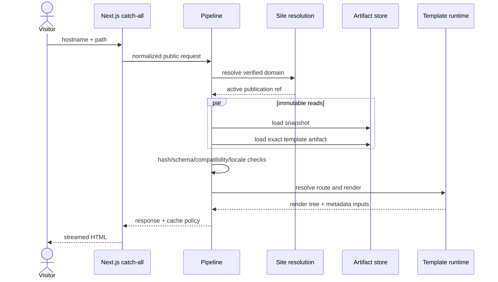

# Specification 04: Rendering Pipeline

Status: Approved for implementation
Prerequisites: Specifications 01–03 (approved)
Architecture source: [`ARCHITECTURE.md`](../../ARCHITECTURE.md)

## Responsibilities

The renderer resolves an incoming hostname/path to one verified website and one immutable publication, loads the exact validated template artifact, resolves locale and template route, renders through the SDK runtime, produces metadata and cache policy, and returns streamed HTML. It also serves signed preview snapshots through the identical route/render core.

It does not mutate drafts, activate publications, discover templates, interpret template content, call dashboard HTTP endpoints, or choose template behavior through branches.

## Public interfaces

```ts
interface RenderRequest {
  hostname: string;
  pathname: string;
  search: Readonly<Record<string, readonly string[]>>;
  headers: PublicHeaderSubset;
  previewToken?: string;
}

interface SiteResolutionPort {
  resolveActive(hostname: NormalizedHostname): Promise<ActiveSiteResolution | null>;
  resolvePreview(claims: PreviewClaims): Promise<PreviewResolution | null>;
}

interface ArtifactReadPort {
  loadSnapshot(ref: SnapshotArtifactRef): Promise<PublicationSnapshot>;
  loadTemplate(ref: ExactTemplateArtifactRef): Promise<ValidatedTemplateArtifact>;
}

interface RenderPipeline {
  render(request: RenderRequest): Promise<RenderResponse>;
}
```

HTTP surfaces:

- `apps/renderer/src/app/[[...path]]/page.tsx`: generic production route.
- `apps/renderer/src/app/_preview/[[...path]]/page.tsx`: signed preview.
- `api/health` and `api/ready`: operational endpoints.
- dynamic `robots.ts` and `sitemap.ts` use the same resolution/read contracts.

Next.js `params`, `searchParams`, `headers()`, and `cookies()` are awaited. Node.js runtime is the default. Metadata is generated only in Server Components.

## Internal components

- request normalizer: IDNA/lowercase hostname, port/trailing-dot removal, safe path decoding;
- preview token verifier: signature, issuer, audience, expiry, snapshot/tenant binding;
- site resolver: cache then database/read model;
- immutable artifact reader with size/hash/schema checks;
- compatibility guard for renderer, SDK, template, and snapshot versions;
- locale resolver with declared fallback policy;
- template runtime factory and route matcher;
- metadata mapper for canonical/robots/Open Graph/Twitter/structured data;
- theme-to-scoped-CSS-variable serializer;
- cache policy builder;
- safe error mapper and observability wrapper.

## Directory structure

```text
apps/renderer/src/
├─ app/
│  ├─ [[...path]]/{page.tsx,loading.tsx,error.tsx,not-found.tsx}
│  ├─ _preview/[[...path]]/page.tsx
│  ├─ api/{health,ready}/route.ts
│  ├─ robots.ts
│  ├─ sitemap.ts
│  ├─ layout.tsx
│  └─ global-error.tsx
├─ server/
│  ├─ container.ts
│  ├─ render-request.ts
│  ├─ metadata.ts
│  └─ cache-policy.ts
└─ styles/platform.css

packages/template-runtime/src/
├─ instantiate/
├─ route-resolution/
├─ render-dispatch/
├─ capability-gateway/
└─ errors/
```

## Data flow



Preview replaces domain/activation resolution with signed temporary snapshot resolution, then rejoins at immutable reads. Preview responses are `private, no-store`; production cache keys include hostname-mapping version, publication ID, locale, path, and declared variant flags.

## Error handling

- malformed/unknown/unverified hostname: neutral 404;
- unknown template route: template not-found result or neutral 404;
- expired/invalid preview: 404 without revealing snapshot existence;
- artifact missing/hash mismatch/schema incompatibility: integrity failure, alert, controlled 503;
- template execution failure: captured with template/publication/route IDs, controlled 500;
- optional capability unavailable: declared fallback; required capability absence is incompatibility;
- dependency timeout: bounded retry only before response streaming, then controlled failure;
- no stack, tenant identity, storage URI, or content is leaked.

The last active publication pointer is never changed by renderer failure. Next.js `error.tsx`/`global-error.tsx` are client error boundaries; server navigation helpers are not swallowed by catch blocks.

## Extension points

- domain/publication cache adapter;
- immutable artifact storage adapter;
- template capability gateway;
- image/media URL adapter;
- shared Next.js cache handler for multi-instance self-hosting;
- observability adapter.

All are ports. Templates cannot add Next.js routes or access request/server primitives directly.

## Implementation order

1. Snapshot/site/artifact read ports and typed errors.
2. Request/hostname/path normalizer and preview verifier.
3. Runtime instantiation and immutable ID dispatch.
4. Locale/route resolution.
5. page/section/block/widget render dispatch and theme variables.
6. metadata, robots, sitemap, canonical, and structured-data mapping.
7. Next.js production/preview catch-all composition.
8. cache policy, shared-cache adapter, health/readiness, and telemetry.
9. Doctor/Clinic production and preview acceptance flows.

## Testing strategy

- unit: hostname/path/locale/canonical/cache/error mapping;
- contract: snapshot and template exact-version compatibility;
- runtime: unknown IDs, route ambiguity defense, capability failure, deterministic output;
- security: IDNA confusion, host header poisoning, preview forgery/replay/expiry, XSS, unsafe URL, structured data escaping;
- integration: cache miss/hit, artifact hash failure, unknown host, publication switch, last-known-good behavior;
- Next.js build: RSC serialization, async request APIs, server-only metadata, no draft/dashboard dependency;
- E2E: Doctor and Clinic render through the same catch-all; preview and production snapshots produce equivalent content; accessibility and SEO checks;
- multi-instance cache invalidation test after every Next.js upgrade.

## Future compatibility

Snapshot readers and exact template artifacts remain versioned and retained. Capability APIs evolve independently. Cache adapters and artifact readers can become region-local without changing pipeline contracts. Template execution may later move to isolation while preserving `TemplateRuntime`. Edge runtime is not assumed. Active-active writes, global mutable state, and marketplace code execution remain deferred.

## Acceptance gate

- No concrete template import/branch exists in renderer or Factory packages.
- Renderer has no draft write/read dependency.
- Preview and production converge on the same immutable core.
- Unknown hosts cannot resolve another tenant.
- Metadata/theme/content come only from validated snapshot/template contracts.
- Failed new artifacts do not affect last-known-good publication.
- Doctor and Clinic pass identical renderer tests.
