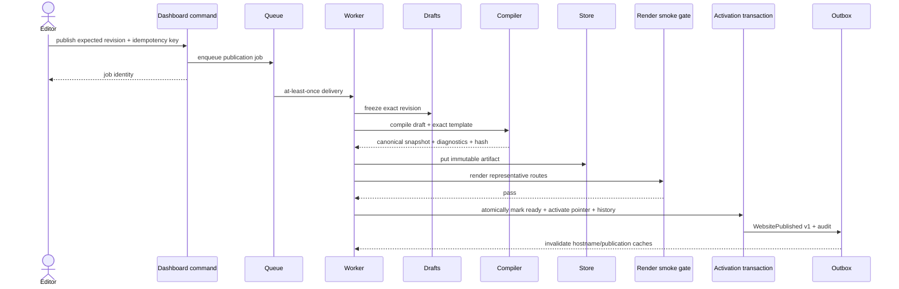

# Specification 05: Publication Pipeline

Status: Approved for implementation
Prerequisites: Specifications 01–04 (approved)
Architecture source: [`ARCHITECTURE.md`](../../ARCHITECTURE.md)

## Responsibilities

The publication subsystem freezes an exact draft revision, validates the complete generic website graph against the exact template artifact, compiles a deterministic immutable snapshot, persists artifact and publication metadata, smoke-renders it, atomically activates it, emits audit/events, and invalidates delivery caches. It also compiles expiring preview snapshots through the same compiler and supports atomic rollback.

It does not interpret industry content, mutate an existing snapshot, silently migrate template versions, render mutable drafts, or couple database/object storage into one fictitious transaction.

## Public interfaces

```ts
interface RequestPublicationCommand {
  organizationId: OrganizationId;
  websiteId: WebsiteId;
  expectedDraftRevision: bigint;
  idempotencyKey: string;
}

interface RequestPreviewCommand {
  organizationId: OrganizationId;
  websiteId: WebsiteId;
  expectedDraftRevision: bigint;
  expiresInSeconds: number;
}

interface RollbackPublicationCommand {
  websiteId: WebsiteId;
  targetPublicationId: PublicationId;
  idempotencyKey: string;
}

interface PublicationCompiler {
  compile(input: CompilationInput): Promise<CompilationResult>;
}

interface PublicationArtifactStore {
  putImmutable(input: ArtifactWrite): Promise<StoredArtifact>;
  get(ref: ArtifactRef): Promise<Uint8Array>;
  deleteOrphan(ref: ArtifactRef): Promise<void>;
}
```

Commands return job/status identities; publish does not hold an HTTP request open. Repositories, artifact storage, smoke renderer, cache invalidator, queue, audit, and event delivery are ports.

## Internal components

- publish/preview/rollback command handlers with authorization/idempotency;
- draft freezer producing a stable generic projection;
- exact template resolver and compatibility validator;
- publication compiler:
  - canonicalizer;
  - page/section/navigation/theme/SEO validator;
  - route compiler and conflict detector;
  - media reference resolver/pinner;
  - locale/fallback compiler;
  - snapshot serializer and integrity hasher;
  - deterministic diagnostics collector;
- artifact writer and orphan tracker;
- smoke-render gate using the rendering pipeline core;
- activation transaction coordinator;
- cache invalidation event consumer;
- preview expiry/garbage collector;
- rollback policy.

## Directory structure

```text
packages/publication-compiler/src/
├─ compile.ts
├─ canonicalize/
├─ validation/
├─ routes/
├─ navigation/
├─ media/
├─ locales/
├─ serialize/
├─ integrity/
└─ diagnostics/

packages/publishing/src/
├─ commands/{request-publication,request-preview,rollback}.ts
├─ queries/
├─ jobs/{compile-publication,compile-preview,cleanup-preview}.ts
├─ activation/
├─ ports/
├─ events/
└─ errors/

apps/worker/src/handlers/publishing/
```

## Snapshot data contract

The canonical snapshot includes snapshot schema version, publication/website/organization identity, exact template identity and artifact hash, source draft revision, locales and fallback policy, compiled routes, pages, ordered sections with opaque validated content and IDs, navigation trees, theme tokens, SEO documents, generic settings, pinned media descriptors, capability configuration, and integrity metadata.

Canonical JSON uses sorted object keys, stable array order defined by `order_key`, normalized numbers/strings, no undefined/class/date/map/function values, and no volatile timestamps inside the content hash. Snapshot byte/depth/collection limits are enforced. Publication and preview use the identical contract.

## Data flow



Preview follows freeze → compile → immutable store → smoke validation, records an expiring preview identity, and returns a signed audience-bound token. It never activates. Rollback locks the website, verifies retained target readiness/compatibility, switches the pointer, writes history/outbox/audit, and invalidates cache.

## State machines and idempotency

Publication: `compiling → validating → ready | failed → retired`. Only `ready` can activate. Records/artifacts never return to an earlier state or mutate content.

Job handlers are idempotent by command/job identity and inspect current state before work. Same publish idempotency key and request hash returns the existing status; changed hash conflicts. Duplicate artifact writes use content-addressed identity safely. Activation transaction can execute once; duplicate event delivery is handled by consumer event IDs.

## Error handling

- stale draft revision: non-retryable conflict before compilation;
- schema/structure/route/navigation/media/theme/SEO invalid: complete safe diagnostics, publication failed, current active untouched;
- incompatible template/Factory/renderer/snapshot: non-retryable compatibility failure;
- transient database/queue/storage: bounded retry with idempotency;
- artifact hash mismatch or compiler nondeterminism: integrity failure, quarantine/alert;
- smoke-render failure: publication failed, artifact retained for short diagnostic/orphan policy, never activated;
- activation serialization/deadlock: bounded transaction retry;
- cache invalidation failure: retry outbox consumer; correctness remains because publication identity is immutable and resolution pointer is authoritative;
- rollback target missing/retired/incompatible/wrong website: safe conflict/not-found.

Diagnostics contain stable code/path and no secrets or unsafe raw content. Failed jobs preserve correlation, template, website, source revision, and trace identifiers.

## Extension points

- immutable artifact store;
- draft projection repository;
- template artifact resolver;
- media resolver/pinner;
- smoke renderer;
- queue/job adapter;
- cache invalidator;
- snapshot migrator for explicitly supported versions.

Plugins may react to versioned post-commit events; they cannot participate in activation transaction or mutate snapshots. Marketplace/multi-region replication remains deferred.

## Implementation order

1. Publication snapshot contract and canonical serialization fixtures.
2. Frozen draft projection/read port.
3. compiler validation/canonicalization/routes/navigation/media/theme/SEO.
4. artifact store port plus local filesystem development adapter and object-store-ready interface.
5. publication/preview database repositories and state transitions.
6. durable idempotent worker handlers.
7. smoke-render integration with Specification 04 core.
8. atomic activation/rollback with audit and outbox.
9. cache invalidation and preview GC consumers.
10. Doctor/Clinic publish/preview/rollback E2E.

## Testing strategy

- golden deterministic snapshot fixtures and hash stability;
- property tests for canonicalization/order/JSON safety;
- full invalid graph diagnostics across every SDK structure;
- stale revision and concurrent editor mutation;
- job duplicate/retry/crash at every stage;
- artifact succeeds/DB fails and DB succeeds/cache invalidation fails recovery;
- smoke-render failure preserves active publication;
- concurrent publish/rollback serialization;
- preview never activates and expires/GCs;
- template/media retention while publications reference them;
- tenant-crossing activation/reference rejection;
- Doctor/Clinic identical pipeline contract tests;
- load tests for publish bursts with per-tenant worker fairness.

## Future compatibility

Exact artifact identity and snapshot versions retain old publications. New compilers write new versions while readers support an explicit window. Migrations produce new snapshots/publications, never rewrite active artifacts. Object storage can replicate globally behind the port. Queue and cache providers can change without command semantics. Multi-region activation remains single-home-region until separately approved.

## Acceptance gate

- One deterministic compiler serves Doctor and Clinic with no branches.
- Preview/production snapshot bytes follow the same contract.
- Failed publish never changes active pointer.
- Publish and rollback are visitor-atomic.
- All side effects are resumable/idempotent and events are transactional-outbox backed.
- Template/content incompatibility is detected before activation.
- Retained publications pin their template and media dependencies.
